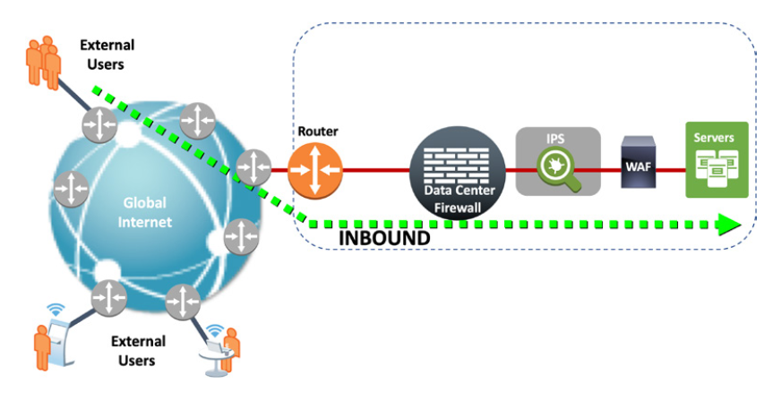
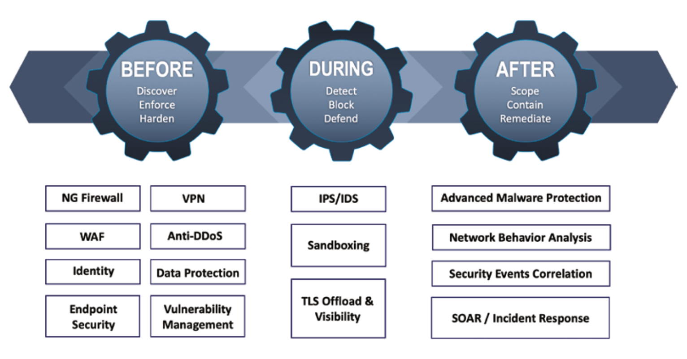

# Security Fundamentals

## Understanding Security

In an attempt to summarise what the practice of security could signify, it is often easier to begin by defining *what it is not*:

- **Security is nether a product nor a service** - there is no single product that acts as a "magic box", security often involves a layered approach with multiple products and services working together
- **Security is not a technology** - technologies may have to respond to attacks but the threat model is an ever-changing object, thus solutions today may not work when facing the newest challenges
- **Security is not static** - processes must exist for dealing with planning, implementation testing and updating security tasks
- **Security is not a check box** - you should use tooling that can demonstrate *true security effectiveness* against threats
- **Security is not made only by a nominal security elements** - dedicated security software and hardware products are not the only approaches, a well-configured networking infrastructure can also help
- **Security is not a beautiful graphical user interface** - you should understand what is happening behind the scenes rather than relying upon dashboards

One of the objectives of security is to ensure that you are protecting your organisation's relevant digital assets of a particular organisation, and thus you need a good understand of it's vision, mission, objectives and any competitors. All of these items are considered in a high-level document know as an *organisational security policy*. 

Typical pieces of information that are used to guide policy creation are:

- **Business Objectives** - tries to answer the classic questions of "*Why are we here?*" and "*What are we trying to achieve?*"
- **Regulatory Requirements** - indicates which regulations are needed to be followed, as well as the type of data that is valuable, for example credit card data
- **Risk** - the acceptable level of risk from the point of view of senior leadership, such as direct financial loss, improper disclosure of intellectual property, damage to organisation reputation etc
- **Cost/Benefit Analysis** - evaluates for the mitigation of the identified risks, i.e. cost/benefit ration of implementing a certain control which may involve investment in products and people to make it possible

A security policy is related to an organisation’s business strategy and is normally written using broader terms. The most common of these broader terms are as follows:

- **Standards** - these specify *mandatory* rules, regulations or activities
- **Guidelines** - provides sets of recommendations, reference actions and operational guides 
- **Baselines** - defines the minimum level of security that is required for a given system type
- **Procedures** - provides step-by-step instructions for performing specific tasks, and how policies, standards and guidelines are implemented

The image below depicts the relationship of the security policy with its companion documents and main sources of information.

When defending important digital assets, it is important to be aware that *attacks happen*. It does not matter whether or not you detect them, or if they have been successful. It is critical to have an attack-and-defence culture in place so that you are always reflecting on potential exposures and how to mitigate the associated risk.

Every networked element is a potential attack target - which might be a server, router, switch, a wireless access point - and a sufficient level of security should be applied - hope is not a strategy!

There should be precisely documented network topologies that provide easy understanding of allowed connections, from sources to destinations. You should deploy elements acting as established *policy enforcement points*, instead of assuming that users and devices will behave properly.

## Basic Security Concepts

The purpose of this section is to provide a reference, within the realm of IT security that can be referred to throughout the certification course.

### Vulnerability, Threat and Security Risk

The concepts of vulnerabilities, threats, and security risks are distinct and yet interrelated:

- A *vulnerability* is a weakness within a system that can be exploited to perform unauthorised actions
- A *threat* is defined by any entity (such as a person or tool) that can exploit a vulnerability intentionally or by accident. Such an entity is known as a *threat actor* or *threat agent*.
- A *security risk* relates to the probability of a certain vulnerability being exploited by a threat actor

### Security Countermeasures and Enforcement

Within a computing environment, the mechanisms aimed at risk mitigation are called *security countermeasures* (or *security controls*), and including the following:

- Software patching
- Implementation of security capabilities that are designed as defensive resources (such as Firewalls)
- Verification of user identity before granting access to data (such as MFA and 2FA)

The mere process of defining access policies is not sufficient, as you must also put in place an enforcement strategy.

### Confidentiality, Integrity, and Availability

The following are foundational attributes that you should consider not only for policy definition but also for evaluation of security effectiveness:

- **Confidentiality** - prevents unauthorised disclosure of sensitive information and exudes a suitable level of privacy is maintained during data processing
- **Integrity** - prevents unauthorised modification of data and ensures that information is accurate (hash function are an example of how to achieve this)
- **Availability** - ensures that systems are reliable and that an acceptable level of performance for legitimate users of computing resources.

### Accountability and Non-repudiation

- **Accountability** - relates to a certain individual or organisation being held responsible for it's actions
- **Non-repudiation** - ensures that someone cannot deny that they have performed an action in an effort to avoid being held accountable, for example someone may deny that a certain system transaction has been carried out or a user denying the authenticity of its own signature

### Authentication, Authorisation, and Accounting

Authentication, authorisation, and accounting are three security functions that are usually combined to deliver access control services.

- **Authentication** - deals with the question "*Who is the user?*" and usually requires the user to provide a username and password. Some systems may treat non-registered users as guests, thus granting a basic level of access.
- **Authorisation** - addresses the question "*What is the user allowed to do?*" and requires the user to have authenticated before authorisation occurs 
- **Accounting** - answers the question "*What did the user do?*". This process (usually a networking device) collects user activity information and sends it to an accounting service, that will provide statistics about legitimate use as well as unexpected user behaviour, such as abnormal access hours.

### Visibility and Context

*Visibility* is not restricted to what you are able to directly see. Tools and techniques have been specifically developed to provide information about many parameters of packet flows, including the hidden ones.

Another important concept for the current security practice is *context*. Providing con- text relates to the ability to gather additional pieces of information around the main one so that ambiguity removal is possible before making policy decisions.

Some examples include:

- A user may be granted different levels of access depending upon the device that is being used, a personal mobile device may receive fewer permissions than a corporate registered laptop
- Access to strategic systems may be deemed normal during the week, but out of office access may indicate misuse and should trigger further investigation
- A certain traffic pattern may be deemed an attack according to the source IP address

## Foundational Networking Concepts

This section will visit two network communication models: the *Open Systems Interconnection* (OSI) model as well as what came to be the most prevalent and successful standard for network-based communications, the *TCP/IP protocol stack*. 

### The OSI Reference Model

OSI divides the communication system into seven abstract layers, each of which is in charge of a well-defined job, while working in a collaborative way, in order to achieve data transmission between two given systems.

Each of the layers are described below:

- **Physical Layer (Layer 1)** is responsible for the physical connection between the devices and is concerned with transmitted raw bits over a communication channel
- **Data Link Layer (Layer 2)** is response for node-to-node delivery of the message in the form of a larger and sequential units of data called frames. At this layer the 48-bit MAC address is used by the ethernet cards.
- **Network layer (Layer 3)** is responsible for routing a unit of data - known as a *packet* - from a source to a destination. This layer introduces the concept of a *logical address*, of which the IP address is the most important example. A larger logical entity - known as a *subnet* - is also defined at this level.
- **Transport Layer (Layer 4)** is responsible for providing reliable message delivery from the source to the destination host regardless of the number of physical or logical networks traversed along the path. This layer is also able to acknowledge the successful transmission and to trigger a retransmission if errors are detected. Source and destination ports are able introduced at this layer, allowing for multiple services ti be run on the some node. The most common transport protocols are TCP and ID both of which belong to the TCP/IP stack.
- **Session Layer (Layer 5)** is responsible for coordinating exchange of requests and responses between application processes running on endpoint machine through sessions handlings as well as controlling the dialogue via half-duplex and full-duplex.
- **Presentation Layer (Layer 6)** deals with the syntax and semantics of the data being transmitted, which allows for different data representations to be transmitted
- **Application Layer (Layer 7)** is the closest to the end user and contains protocol such as HTTP, FTP and DNS

### The TCP/IP Protocol Stack

The OSI Model is a logical and conceptual model that defines network communication used by systems open to interconnection and communication with other systems, where as the TCP/IP stack determines how a specific computer should be connected to a network (like the internet) and how data can be transmitted between them.

The image below compares the differences between the OSI model and the TCP/IP Stack.

## Main Classes of Attacks

This section provides an overall view of the main classes of threats. It should be noted that the descriptions that follow should not be deemed complete, mainly because this is a dynamic subject matter. Furthermore, it is common to find some types of attacks falling within more than one class.

### Reconnaissance

*Reconnaissance* is an attach preparation phase in which the attacker is trying to gain as much information as possible about the target without interacting with their main application.

ICMP ping sweeps, port scanning and social engineering are all examples of reconnaissance attacks.

### Password Attacks

Many attackers will leverage techniques that allow them to be authenticated as regular privileged users, without the underlying account owner being aware. Two possible ways of accomplishing such a goal are:

- Creating a new privileged account
- Compromising an existing account and elevating its privileges

*Brute-force* attacks are those in which all possible combinations of letters are sequentially tried by a program. 

A *dictionary* attack assumes that users tend to select a common word (typically small) to build their passwords

### Eavesdropping Attacks

*Network eavesdropping*, also called *sniffing*, is used to obtain data that being transmitted over a network. Eavesdropping attacks can be categories as either passive or active.

In passive eavesdropping, the attacker listens to the message exchange that takes place over the network, such as using a wiretap, or connecting to a shared router or hub. 

In active eavesdropping, the attacker tries to produce the mirroring effect but does not need to configure it. Some examples are the exploitation of weaknesses in auxiliary local area network (LAN) protocols such as Dynamic Host Configuration Protocol (DHCP) or Address Resolution Protocol (ARP).

### IP Spoofing Attacks

*IP spoofing* is the act of copying or falsifying a trusted source IP address. Typical motivations behind IP spoofing are

- Impersonating a trusted user (or host) and taking advantage of the privileges associated with this trust relationship
- Diverting attention away from the actual attack originator in an attempt to remain undetected

### Man-in-the-Middle Attacks

*Man-in-the-middle (MitM)*  is a broad class of attacks that involve a hacker maliciously inserting a third system into a two-part network conversation or transaction.

### Denial-of-Service Attacks

A *denial of service* (DoS) attack induces exhaustion of processing resources (on either connectivity devices or computing hosts), thus keeping legitimate users from accessing the intended applications. DoS attacks can occur in many layers of the OSI reference model, as illustrated in the following examples:

- **Layer 4** The *TCP SYN flood* attack can be used that exploits the *three-way handshake* that TCP uses for connection setup. It achieves this by the attack not sending the ACK message back to the server thus creating a substantial number of half-open connections on the server, which may ultimately result in exhausting the server's resources
- **Layer 3** Examples of Layer 3 DoS attacks are the Ping of Death (large ICMP Echo messages are sent to cause buffer overflows), the *Smurf* attack (where an attacker broadcasts an ICMP Echo message using a target host IP as it's source, causing the server to become flooded), and the *teardrop* attack (where an attacker sends fragmented IP packets to a target host, causing the host to crash when it reassembles them)
- **Layer 2** The Spanning Tree Protocol (STP) was created to remove looped connections in an Ethernet LAN. An attacker may send false messages to initiate STP recalculations that can lead to a LAN environment becoming unavailable.

### Malware Attacks

 A *malware* is a software program designed to perform unauthorised actions on computer systems and is often installed through known vulnerabilities. Some common types are malware are:

- **Virus** is a piece of malware that requires some kind of human interaction to start its job, and will self-replicate itself by inserting its code into other programs and files
- **Worm** is a piece of malware that does not require a program to trigger its execution, and will self-replicate and spread throughout a network infecting devices that do not have suitable protection in place
- **Trojan Horse** is a destructive program that deceives the user by posing as a genuine application, and will often steal and destroy data on the infected machine
- **Adware** is focused on presenting unwanted advertising to users and is typically bundled with free software or browser toolbars
- **Launcher** is used to download other malicious software and is normally used as the initial compromise
- **Key logger** is designed to stealthily record everything that is typed on a computer keyboard and transmit the data to a remote agent
- **Ransomware** will encrypt all user files on the target machine and will display a message asking the user to pay for decryption

### Phishing Attacks

*Phishing* is the practice of sending fraudulent emails that appear to have come from trusted sources with the objective of obtaining personal information or inducing the victim to per- form some action, such as clicking on a hyperlink that will install malware.

*Spear phishing* is a more advanced technique in which the attackers include information that looks personal and is meaningful for the victims.

## Risk Management

Defence related activities against common attack categories can be categorised as :

- Understanding what each of the security technologies in your protection toolbox can bring to the game

- Knowing your key security personnel and determining the level of security education in your organisation

- Designing the security processes to be implemented 
- Spreading the security culture inside your team and organisation

### Firewalls

A *firewall* is a security system aimed at isolating specific areas of the network and delimiting domains of trust. The firewall acts as a sort of *conditional gateway*, specifying the traffic types allowed to go from one domain to another by means of access control policies.

There are various generations of firewalls that operate at different levels of the OSI layers, some of which are outlined below:

- **Packet Filters** focus their access control efforts on static parameters related to the network and transport layers. These are *stateless* and only act on individual packets
- **Circuit-Level Proxies (or Generic Proxies)** establish *sessions*  (OSI Model Layer 5) to the destination on behalf of the requester. The classic implementation os the SOCKS5 software.
- **Application-Level Proxies (or Dedicated Proxies)** understand and interpret commands within the application protocol that they are serving (such as HTTP) and will often provide additional functionality such as authentication, logging and error handling.
- **Stateful Firewalls** incorporate the concept of connections and *state* to the original packet filters. They have a set of access control rules that act upon *groups of packets* that belong to the same connection (or *flow*), rather than on individual packets.
- **Next-Generation Firewalls (NGFWs)** use stateful inspection as a departure point, and are able to identify traffic even if it's not travelling on the standard port. These firewalls are able to produce user-base rules, as well as filtering URLs and decrypting SSL channels to inspect the content in the communication payload.

### Web Proxies (Web Gateway)

A *web proxy* (also known as a web gateway) is an important example of an application- level firewall, typically used to control the access of internal corporate users to outside web servers (*outbound* access control). 

A web proxy may also capable of blocking malware, enforcing acceptable-use policies, categorising and filtering URLs, and controlling content based on the reputation of the sites hosting it.

Given the evolution of NGFWs, this well-known security element is falling into obsolescence.

### Web Application Firewalls

The web application firewall (WAF) is a specialised security element that acts as a full-reverse proxy, protecting applications that are accessed through the HTTP protocol. 

A WAF will analyse each HTTP command against a set of policies to ensure that the action is allowed. Some of the most common vulnerabilities that WAFs protect against are code injection and cross-site-scripting.

Web proxies protect the client, whereas the WAF protects the service side of the connection.

### Intrusion Detection and Intrusion Prevention

Intrusion-detection and intrusion-prevention technologies provide in-depth inspection capabilities so that the occurrence of malicious traffic can be discovered inside network packets, at either their header or data portion.

*Intrusion-detection system* (IDS) devices handle only copies of the packets and are mainly concerned with monitoring and alerting tasks, while *intrusion-prevention system* (IPS) solutions are deployed inline in the traffic flow and have the inherent design goal of avoiding actual damage to systems.

IPSs act as a normal companion to stateful firewalls, mainly for data centre protection (inbound traffic). They provide detailed analysis for the connections permitted by firewalls, thus complementing their work

IPSs will concentrate most of its analysis at the Network, Transport and Application layers, possibly maintaining state (*stateful pattern matching*) and executing traffic anomaly detection.

The image below highlights a typical coordination of protection devices that are suited for controlling *inbound* access.

### Virtual Private Networks

The term *virtual private network* (VPN) is used to refer to technologies that reproduce the characteristics of a private corporate network, even when traffic is being transported over a public or shared network infrastructure.

SSL VPN is another remote access VPN technology that does not require a dedicated client. One benefit to the SSL VPN is the fact that SSL is used everywhere (mainly for HTTP protection) and, as a result, is permitted through firewalls and routers along the path.

A classic topology for VPN termination is shown below.

### Protecting DNS

The Domain Name System (DNS) is a hierarchical and decentralised directory that maps the assigned hostnames of resources connected to the Internet or other IP networks to their corresponding IP addresses.

The database holding the DNS records is distributed, and is contracted in a collaborative way, and the exchange of information pertaining to this process relies on the DNS protocol.

### Tools for Vulnerability Analysis and Management

The *vulnerability assessment* process involves identifying and classifying vulnerabilities in the digital entities that compose the computing environment under analysis. After this information-gathering phase, the findings should be presented in a structured fashion so that the corrective actions can be prioritised according to the risk level.

Some of the typical tasks in included in the  *vulnerability assessment* process are:

- **Inventory Compiling** is the process of building a hardware and software inventory of the environment to help in minimising the attack surface. Assets that are mission critical should be identified and groups according to their business value.
- **Identified of Vulnerabilities** is the process of running scanning tools through the collected inventory in order to create a current list of vulnerabilities as well as sourcing their locations (such as software bugs and misconfigurations).
- **Definition of Priorities** is the process of assigning a priority for each vulnerability. Some vulnerabilities will have a higher critical level and thus will likely need to be resolved earlier.
- **Remediation** is the process of building a road map of actions to be taken so that you reduce the exposure level
- **Effectiveness Measurement** allows for you to evaluate the process (ideally after remediation) to ensure improvements can be made to the process

Note: *Security is not just about technology. It is a continuous process, that involves people*. 

### Correlation of Security Information and Events

*Security information and event management* (SIEM) solutions are designed to collect security-related logs as well as flow information generated by systems (at the host or application level), networking devices, and dedicated defence elements such as firewalls, IPSs, IDSs, and antivirus software. 

They work by aggregating, normalising, and categorising the received information and then applying intelligence algorithms that allow them to correlate events that refer to particular sessions.

SIEM solutions may be employed for the following reasons:

- To lower the volume of data that must be dealt with by removing ambiguous session information and avoiding the generation of events for legitimate resource use

- To provide real-time insights on security alerts, clearly separating what is meaningful in an attempt to minimise the occurrence of false positives

- To prioritise response actions so that the most critical issues are treated first (according to associated risk level)

Modern SIEM solutions include *artificial intelligence* (AI) and *user behaviour analytics* (UBA) so that they can quickly spot deviations from the normal network activity profile for a particular user.

### TLS/SSL Offload and Visibility

*Secure Sockets Layer* (SSL) protocol was developed to provide services such as data integrity, confidentiality, and peer authentication for application protocols that are carried over TCP. SSL 3 was replaced in 2015 standards-based Transport Layer Security (TLS) protocol.

By deploying TLS-offload operations, these solutions can provide many benefits to application web servers such as ensuring malicious traffic does not reach the application servers, as well as removing any encryption duties from the application server, which is computationally expensive.

### Handling Security Incidents

An *incident* is defined as a violation (or a threat of violation) of security policies, acceptable-use policies, or standard security practices. Events after an incident may be a negative impact to a company's reputation, a loss of intellectual property, or unauthorised access to data.

To deal with these sorts of events, you should establish an *incident handling program*. For instance, you should define the meaning of "incident" within your organisation. Another important step is to assign an incident response team, with clearly defined responsibilities, among which creating an incident response plan deserves special mention.

## Well-Known Security Frameworks and Models

The concept of security risk is based on the likelihood of a certain vulnerability being exploited, and its respective impact potential, which depends on the value of the digital asset under analysis.

The underlying goal of reducing risk inspired the creation of *security frameworks*, which are published materials that typically include standards, guidelines, sample policies, recommended security safeguards and tools, risk management approaches, relevant technologies, and recognised best practices for protection of certain computing environments.

The following list provides example security frameworks that are in use:

- **Payment Card Industry Data Security Standard (PCI DSS)** was created with the goal of increasing the level of protection for issuers of credit cards by requiring that merchants meet minimum levels of security when they process, store, and transmit card holder data
- **Health Insurance Portability and Accountability Act (HIPAA)** is set of security standards for protecting certain health information that is transferred or held in electronic format
- **National Institute for Standards and Technology Cybersecurity Framework (NIST CSF)** is a framework that recognises that the cybersecurity activities inside an organisation should be guided by its business drivers. 
- **General Data Protection Regulation (GDPR)** is a set of rules created by the EU that requires businesses to protect the personal data and privacy of EU citizens. GDPR not only applies to transactions that occur within the EU members but also governs the transfer of personal data outside the EU.

### Sample Practical Models for Guiding Security Design and Operations

Rather than focusing on security standards that apply to the type of organisation you are in charge of protecting, you should become familiar with those principles that can be employed in a broader sense.

Generically speaking, security controls are divided into three main categories:

- **Physical Controls** are designed to protect facility, personnel, and material resources, such as locks, fencing, monitoring cameras, and security agents.
- **Logical Controls** are solutions such as firewalls, WAFs, intrusion detection and prevention, VPNs etc (see [Risk Management](#risk-management)).

- **Administrative Controls** contain aspects such as risk management processes, security documentation, and training (not only specific to operations but also to promote overall security awareness within the organisation).

### The Security Wheel

 The *security wheel*, a closed-loop model for security operations that is centred on the foundational concept of security policy. The model recognises that the security practice has a continuous and cyclical nature and is structured in five basic stages:

1. **Develop a Security Policy:**  Start with a high-level policy that clearly establishes and documents the strategic goals that relate to the business drivers or mission of the organisation.
2. **Implement Security Measures:** After identifying the assets that need to be protected and the appropriate protection level, you next deploy the security controls that will contribute to risk mitigation (examples might include firewalls, WAFs, VPNs - [Risk Management](#risk-management) for more examples).
3. **Monitor Continuously:** Resources such as logging, intrusion detection, and SIEM are employed to spot violations of the access policies.
4. **Test:** Continuous testing of the security measures should be performed - systems evolve rapidly and new ways to exploit their weaknesses will be readily available. 
5. **Manage and Update:** Using feedback from stages 3 and 4 improvements can be applied to stage 2 in the form of new or updated controls.

### The Attack Continuum Model

Security a moving target. Building on the axiom that *attacks happen*, the attack continuum model associates the security controls with the phase to which they relate most: *before*, *during,* or *after* the attack. 

The image below represents the attack continuum model and suggests some security solutions that may fit each of the model phases.

- **Before:** The tools and methods used here refer mainly to attack *prevention* tasks. The motivation is to have the controls that allow you to minimise the attack surface.

- **During:** *Detection* and monitoring tools, which provide visibility and awareness of what is going on during live packet flow, are the key types of resources for this stage.

- **After:** The protection mechanisms for this phase should identify the point of entry, understand its reach, contain the propagation, and remediate any eventual damage or disruption.

### The Zero Trust Model

The z*ero trust,* model is based on the *principle of least privilege*, which states that organisations should grant the minimal amount of permissions that are strictly necessary for each user or application to work. Therefore, they should not implicitly trust any entity, at any time, no matter if it resides outside or inside the organisation domains.

The reason for such a model is to deal with organisations promoting a blind trust of inside hosts and networks, with the typical assumption that internal systems are reliable. This is a flawed approach, because if a single inside host is compromised, lateral movement and associated threat spread will become easy tasks. 

From a network traffic standpoint, this new security paradigm advocates heavy use of network segmentation, encryption technologies, and identity-based access controls, both at the user and the device levels.

Some relevant controls guided by this model are as follows:

- Using advanced authentication and authorisation resources, before granting access, is key for avoiding undesired use of your computing resources or, even worse, unauthorised access to data under your control.

- Promoting granular segmentation of the network, up to the point where you are able to define access control rules down to a single instance level (when necessary), is another key measure associated with the new “shared land” reality. This fine-grained rule-building practice is frequently called *micro-segmentation*.

- The use of encryption technologies everywhere is key to bring the confidentiality and integrity attributes to the scene, thus helping you to ensure that data privacy has not been compromised and that data remains unaltered.