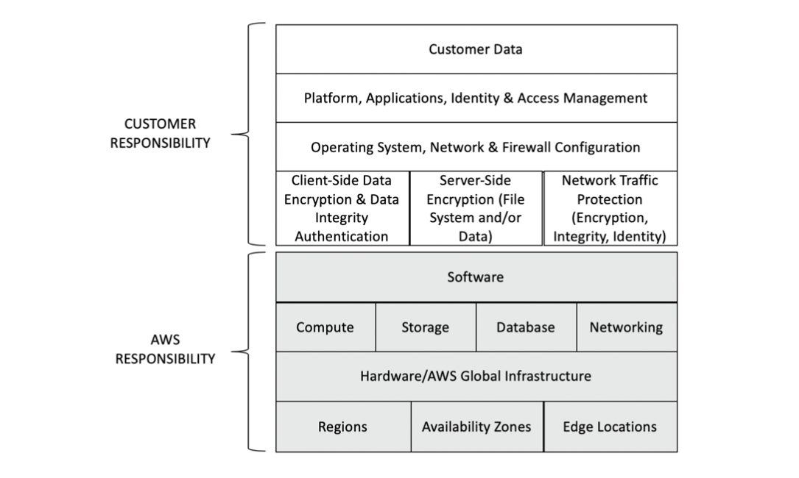

# Cloud Security Principles and Frameworks

The concepts that are outlined in this chapter are critical in your journey to pass the AWS Certified Security Specialty exam. The following topics will be introduced:

- The Shared Responsibility Model
- AWS Compliance Programs
- AWS Well-Architected Framework
- AWS Marketplace

## The Shared Responsibility Model

The Shared Responsibility Model defines the boundaries and responsibilities belonging to AWS and those belonging to the customer regarding security and compliance. AWS is in charge of security and compliance *of the cloud*, and customers are in charge of security and compliance *in the cloud*.

AWS offers a variety of cloud services, such as Amazon EC2 instances, Amazon RDS databases, and AWS Lambda functions. The Shared Responsibility Model has features that depend on the type of service you are deploying, as outlined below.

### Infrastructure Category

The infrastructure category includes AWS Cloud services such as Amazon EC2, Amazon EBS, AWS Auto Scaling, and Amazon VPC.

Customers are responsible for the operating system, security controls, data encryption, firewall rules and network configuration, while the hypervisor (software, compute, networking) along with the physical security of the data centres is the responsibility of AWS.

### Container Services Category

The container services category includes AWS services that commonly run on Amazon EC2 instances (or other compute instances available in the AWS Cloud) where you, as a customer, do not manage their OS or their platform components.

Customers are still in charge of data encryption, network traffic protection and firewall access, but the platform and management of the OS and well as lower-layer controls becomes the responsibility of AWS.

The Container Services category also applies to AWS Services such as Amazon RDS and Amazon Elastic MapReduce (EMR) as AWS manages the underlying infrastructure (such as the OS and the platform), and also provides additional functionality such as backup and recovery tools. It is the customer's responsibility to define and configure the disaster recovery and business continuity policies (i.e. customer is responsible for "Customer data").

### Abstracted Services Category

The abstracted services category encompasses higher-level services such as Amazon S3, Amazon DynamoDB, Amazon SQS, and Amazon SES. These are known as abstracted services, as you are using a multi-tenant platform that is configured to securely isolate your data.

Customers are still in charge of data protection as well as IAM policies.

## AWS Compliance Programs

Due to its global presence, AWS must comply with various regulations and best practices for security, compliance, and data protection around the world. 

AWS supports a number of security best practices and standards. Some of the most commonly known standards are listed below:

- **ISO 27001** is a standard that is used to define and implement an information security management system and is part of the wider ISO 27000 information security standards family.
- **ISO 27017** is focused on the information security practices for cloud computing, and defines best practises and security controls that a cloud service provider must implement.

- **ISO 27018** defines guides that help to protect *personally identifiable information* (PII) for public cloud environments.
- **PCI DSS** is an information security standard for organisations that handle and store credit card information.
- **CSA STAR** is standard helps cloud service providers, customers, auditors, and consultants to verify that available cloud security controls meet the adequate level of assurance required to protect data.
- **SOC 1, SOC 2, SOC 3** are independent third-party examination reports that demonstrate how AWS achieve compliance and controls objectives, which help auditors understand the AWS security control models.
  - **AWS SOC 1 Type 2 Report** evaluates the effectiveness of AWS controls that might affect internal controls over financial reporting (ICFR).
  - **AWS SOC 2 Privacy Type I Report** assesses the AWS controls that meet the American Institute of Certified Public Accountants (AICPA) criteria for privacy. 
  - **AWS SOC 2 Security, Availability, & Confidentiality Report** assesses the AWS controls that meet the American Institute of Certified Public Accountants (AICPA) criteria for security, availability, and confidentiality. 
  - **AWS SOC 3 Security, Availability, & Confidentiality Report** summaries the AWS SOC 2 report.

Using the above listed certifications and reports, you can evaluate how the security controls are implemented in the AWS data centres and services, and thus determine whether the level of compliance will achieve the protection you desire for your business.

### AWS Artifact Portal

The AWS Artifact portal is a service that provides you with access to security and compliance reports that apply to the AWS public cloud.

AWS Artifact allows for the generation of the compliance reports that allow you to evaluate the AWS security controls and posture independently. 

## AWS Well-Architected Framework

The *AWS Well-Architected Framework* was developed to help customers, build secure, high-performing, resilient, and efficient infrastructure for your applications. 

The framework defines best practices in five pillars: security, operational excellence, reliability, performance efficiency, and cost optimisation.

The *AWS Well-Architected security pillar* has seven security design principles:

- **Implement a Strong Identity Foundation:** The least privilege principle should always be used by creating a *segregation of duties* (SoD), using the proper IAM roles and permissions, defining the appropriate authorisation for each resource that will interact with the AWS Cloud
- **Enable Traceability:** Enabling audit logs as well as creating alerts on certain events allows for the monitoring of events that can be actioned by one or several teams based upon a play book of steps.
- **Apply Security at All Layers:** Security practises should be applied at every level of an application including OS security, load balancer security, networking security etc.
- **Automate Security Best Practices:** Automation is a key function in cloud security and leveraging it ensures that paper security policies are implemented as code.
- **Protect Data in Transit and at Rest:** Data should be protected both at the exchange and storage layers via the use of encryption and tokenisation. Access policies can limit access to sensitive data and should be used appropriately.
- **Keep People Away from Data:** Reducing manual and human access to production data ensures that operational risks related to human mistakes are kept to a minimum when handling sensitive data.
- **Prepare for Security Events:** Incident response management places should be enforced and simulated regularly to ensure that security incidents are handled effectively.

### Using the AWS All-Architected Tool

AWS Well-Architected Tool can execute an assessment against your AWS environments to ensure that your setup is meeting all the requirements of a Well-Architected application.

## AWS Marketplace

The AWS Marketplace is a digital catalog that offers thousands of software solutions from third-party software manufacturers. There are many solutions that can be used to improve your security controls when using the AWS Cloud.

Through the AWS Marketplace, you can purchase the solutions directly from technology partners and quickly provision such specialised workloads within your AWS account, with just a few clicks.

Many solutions allow you to use your previously available licenses on a process that is also known as the Bring Your Own License (BYOL) model.
