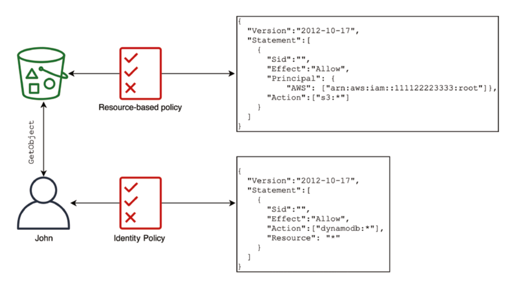
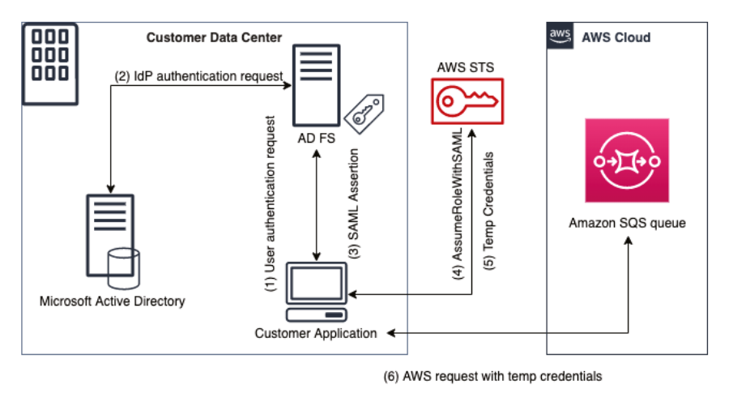
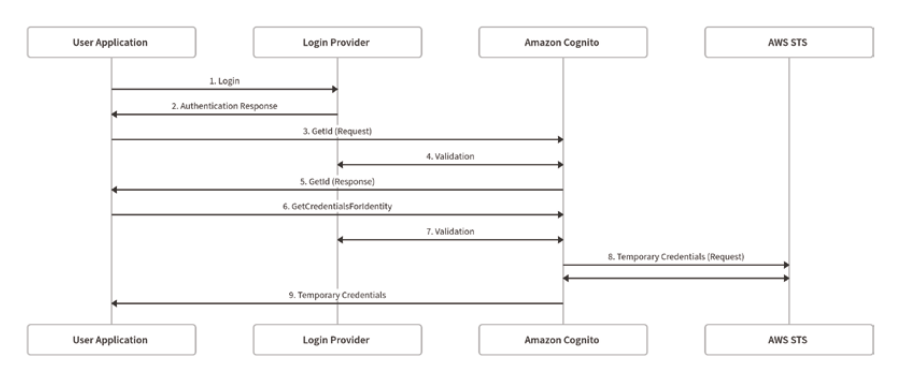
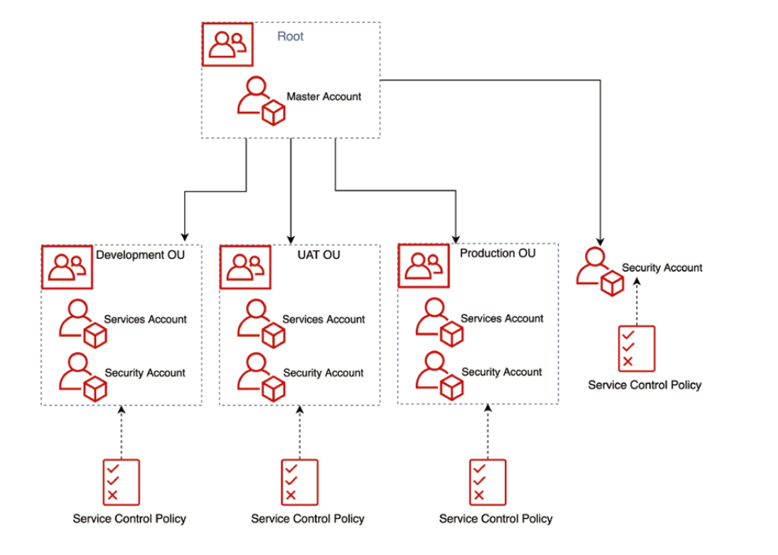
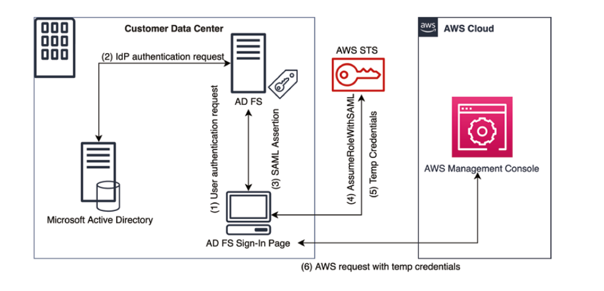

# Identity and Access Management


## AWS IAM

AWS Identity and Access Management (IAM) provides a set of APIs that control access to your resources on the AWS Cloud. AWS IAM gives you the ability to define authentication and authorisation methods for using the resources in your account.

### Principals

A *principle* is an AWS IAM entity that has permission to interact with resources in the AWS Cloud. A principal can represent a human user, a resource or an application and the permission can be permanent or temporary.

There are three types of principles, *root users*, *IAM users*, and *roles*.

#### Root Users

A root user provides you unrestricted access to all the AWS resources in your account, such as viewing billing information, changing your root account password, deleting all resources and closing the account.

Daily operations should not use the *root user*, and AWS recommends that your secure your AWS account by following these recommendations:

- Use a strong password on the root user account
- Enable MFA on the root user account
- Do not create access keys using the root account (use another IAM account instead)
- Never share the root user password

#### IAM Users

An *IAM User* is a person or application in your organisation. Each IAM user persist in the account they were created in, but can be granted permissions to other accounts if configured to do so.

Each IAM user has it's own username and password along with access keys to provide programmatic access to AWS resources.

In order to avoid using your root user account, you should create an IAM user for yourself and then assign administrator permissions for your account so that you can add more users when needed.

#### IAM Groups

An *IAM group* is a good way to allow administrators to manage users with similar permissions requirements.

Groups can be created based upon related to job functions or teams such as administrators, developers, QA, FinOps, operations, and so on. Additionally permissions can be assigned to groups, allowing for users who are assigned to the group, to inherit those permissions.

***Note:** An IAM group is not an identity because it cannot be referred to as a principal when you’re setting up permission policies. It is just a logical organisation that allows you to attach policies to multiple users all at once.*

### IAM roles

*IAM roles* have a permission policy that determines what the IAM role can and cannot do in AWS. An IAM role is not exclusively associated with an IAM user or group; they are assumed by other entities such as IAM users, applications or services.

When an IAM role is assumed, it is granted temporary credentials by the *AWS Security Token Service (STS)*. The temporary credentials are valid throughout the role session usage, have have a lifetime of between 15 minutes and 36 hours (default is 1 hour).

Roles can be used to delegate access to resources that services, applications, or users do not normally have. For example, you can allow an application to assume a role that provides access to a resource in a different AWS account even if its original permissions did not allow such access.

IAM roles can be used in the following scenarios:

- Grant permissions to an IAM user in the same AWS account as the role, or a different account (known as *cross-account access*)
- Grant permissions to applications running on Amazon EC2, which is called *AWS service role for an EC2 instance*.
- In user federation scenarios, it’s possible to use IAM roles to grant permissions to external users authenticated through a trusted IdP.

### AWS Security Token Services

The *AWS Security Token Services (STS)* is designed to provide trusted users and services with temporary security credentials that control access to AWS resources.

The main differences between long-term access keys and temporary security credentials issued by AWS STS are as follows:

- When you issue a temporary security credential, you can specify the expiration interval of that credential, which can range from a few minutes to several hours. 
- Once the temporary credentials are expired, they are are no longer recognised by AWS, and any API requests made with
  them are denied.
- Temporary credentials are dynamic and generated every time a user requests them. A user can renew the temporary credentials before their expiration if they have permission to do so (by assuming the role again). Temporary credentials are valid for between 15 minutes and 1 hour.

*Note: `AssumeRoleWithWebIdentity`` is not longer recommended by AWS, instead you should use Cognito.*

#### STS Version 1 vs Version 2

STS v1 uses the Global STS service and only supports the AWS Region that are enabled on the AWS Account.

STS v2 uses the regional endpoints, which helps to reduce latency. Tokens can be used for any region, regardless of their issuing region.

STS v1 tokens do not work with STS v2.

**Exam Tip:** If an error occurs such as "AWS was not able to validate the provided access credentials", the answer will be one of:

1. Use the regional endpoint (in any region), which will return v2 tokens 
2. Configure STS Global endpoint to issue STS Tokens V2 (it will default to v1)

#### STS External ID

At times, you need to give a third party access to your AWS resources (delegate access). One important aspect of this scenario is the External ID, which is optional information that you can use in an IAM role trust policy to designate who can assume the role.

The IAM Role will have a condition of `sts:ExternalId` that should equal the ExternalId, e.g. `12345`. *Note: AWS recommends using a random unique value, such as a UUID.*

This will help to solve the "confused deputy" problem (as shown below).


#### STS Revoke Temporary Credentials

If STS credentials are exposed, you will need to add an inline policy into the Role that has been used by the exposed credentials.

The inline policy will deny all actions if the token is older than a given timestamp (the timestamp of the compromise).

The condition similar to the one shown below, should be assigned as an inline policy, which will prevent anyone from using the role if their token was issues before the given timestamp.

`"Condition": {"DateGreaterThan": {"aws:TokenIssueTime": "2020-01-01T00:00:01Z"}}`


#### Roles for Cross-Account Access

*Roles for cross-account access* grant users of one AWS account access to resources in a different account.

One common use case can be two AWS accounts, such as *development* and *production*, where users from the *development* account must access resources within *production* account. 

The regular permissions to a developer in the *development* account do not allow them to directly access the resources in the *production* account. In lieu of this, it’s possible to define a trust policy that allows a developer in the *development* account to assume a role in the *production* account. 

First, an IAM role would need to be setup within the *production* account that has the required permissions (see below).

```json5
// [Production Account] Role Permission Policy
{
  "Version": "2012-10-17",
  "Statement": [
    {
      "Action": [
        "s3:ListBucket",
        "s3:GetBucketLocation"
      ],
      "Effect": "Allow",
      "Resource": "arn:aws:s3:::production-account-bucket-name"
    },
    {
      "Effect": "Allow",
      "Action": [
        "s3:GetObject",
        "s3:PutObject",
        "s3:DeleteObject"
      ],
      "Resource": "arn:aws:s3:::production-account-bucket-name/*"
    }
  ]
}
```

Next the *production* account role's trust policy must allow a user (or a role) from the *development* account to assume the role in the production account:

```json5
// [Production Account] Role Trust Policy
{
  "Version": "2012-10-17",
  "Statement": {
    "Effect": "Allow",
    "Principal": { 
      "AWS": "arn:aws:iam::development-account-id:root" 
    },
    "Action": "sts:AssumeRole",
  }
}
```

Finally, an IAM role or user will need to be granted permissions to assume the IAM role that was created within the *production* account. For example, the following permissions policy must be added to the IAM user or role.

```json5
// [Development Account] IAM Role (or user) permissions policy
{
  "Version": "2012-10-17",
  "Statement": {
    "Effect": "Allow",
    "Action": "sts:AssumeRole",
    "Resource": "arn:aws:iam::production-account:role/ProductionAccountRole"
  }
}
```

Once the policies have been established, a user from the *development* account can assume the production role, using the following `aws sts assume-role` command:

```shell
aws sts assume-role \
  --role-arn "arn:aws:iam::production-account:role/ProductionAccountRole" \
  --role-session-name production-account-role-name
```

#### AWS Service Role for an EC2 Instance

*AWS service role for an EC2* is an IAM role that can be attached to multiple Amazon EC2 instances, which allows your applications to securely make API requests from your instances without the need to manage the security credentials that applications use.

For example, imagine an EC2 instance needs to post a message to SQS. Rather than having to manage user access keys, a role can be attached to the EC2 instance with the required permissions to access SQS, which in turn allows the EC2 instance to assume the role and perform the actions with temporary credentials.

### Access Management with Policies and Permissions

Access to AWS resources is managed through JSON *policy* documents, which are attached to IAM identities or AWS resources.

AWS evaluates policies during API requests,using the following criteria:

- All requests are denied by default because they follow the principle of least privilege.
- If your policy has an explicit allow directive, it will override the default.
- Permissions boundaries, service control policies, and session policies can override the permissions defined in policy documents.
- If you place an explicit deny on your policy, it will override any allow directive present in the document.

#### JSON Policy Documents

The JSON policy document consists of the following elements:

- **Version:** this is the version of the policy language (latest version is 2012-10-17).
- **Statement:**
  - **Sid (Optional):** a identifier to differentiate states (can be used like a descriptor or label).
  - **Effect:** specifies whether the policy *allows* or *denies* something.
  - **Principal:** defines the principal that is affected by that statement (only used for resource-based policies, in identity-based policies the principal is implicit)
  - **Action:** a list of methods that the policy *allows* or *denies*
  - **Resource:** specifies which resources the policy is applicable to (only used for identity-based policies)
  - **Condition (Optional):** allows for custom logic to be used to test values of specific keys in the context of the request, for example whether MFA is enabled via `aws:MultiFactorAuthPresent`.

***Note**: The AWS Certified Security Speciality exam requires you to understand the JSON syntax and the policy document structure.*

#### Identity-Based Policies

Identity-based policies are JSON permissions policies that you can attach to an identity such as IAM users, IAM groups, or IAM roles, and define the actions that the principal can perform. These can be categorised into three different types:

- **AWS-Managed Policies** are provided and managed by AWS that cover the most common use cases, such as `AmazonS3ReadOnly` or `AmazonSQSFullAccess` - these policies may change based on AWS's discretion.
- **Customer-Managed Policies** are policies that are created and managed by you within your account. These policies can be attached multiple entities (user, role or group).
- **Inline Policies** are policies that are directly embedded into the entity (user, role or group) and will live within the entity - inline policies cannot be shared.

#### Resource-Based Policies

A resource-based policy allows you to directly attach permissions to AWS resources, such as an Amazon SQS queue or an Amazon S3 bucket. It also allows you to specify who has access to that resource even if it does not have an explicit identity-based policy that says so.



The image above shows that the user John, does not have access to the S3 bucket via an identity policy, but does have access via the S3 resource policy, which will allow the `GetObject` request to complete successfully.

#### Defining Permissions Boundaries

*Permissions boundaries* allow you to define the maximum permissions a user or application can be granted by <u>IAM identity-based policies.</u> You can use a customer-managed or an AWS-managed policy to set the permissions boundaries for an IAM user or role.

Permission boundaries do not add permissions, but define the limits of the permissions attached to them, for example, a user could be granted an administrator policy (see below).

```json5
// Administrator user policy
{
  "Version": "2012-10-17",
  "Statement": [
    {
      "Effect": "Allow",
      "Action": "*",
      "Resource": "*"
    }
  ]
}
```

The user can have their administrator policy limited, by applying a permissions boundary. The example below, will limit the user to S3 operations only (event though they have an administrator policy attached)

```json5
// Permissions boundary, restricting to Amazon S3 operations only
{
  "Version": "2012-10-17",
  "Statement": [
    {
      "Sid": "Allow-Amazon-S3-Access-Only",
      "Effect": "Allow",
      "Action": [
        "s3:*"
      ],
      "Resource": "*"
    }
  ]
}
```

When using permission boundaries, the resulting permission set that is allowed is known as *effective permissions*. IN the example above, the effective permissions would be S3 access, even though the administrator policy was applied.


### Multi-Factor Authentication (MFA)

AWS multi-factor authentication (MFA) is a best practice that requires a second authentication factor in addition to user name and password sign-in credentials. You can enable MFA at the AWS account level for root and IAM users you have created in your account.  

AWS Supports the following devices:

- Virtual MFA Device (e.g. app installed on your phone)
- U2F Key fob (e.g. a Yubi key)
- Hardware Key fob (e.g. for use with the GovCloud)

Enabling MFA delete on resources prevents destructive operations from occurring, such as:

- Permanently deleting an object version in S3
- Suspending versioning on an s3 bucket

*Note: Only the bucket owner (i.e. the root account) can enable disable MFA delete.*

#### MFA & IAM Conditions

You can force the use of MFA as part of an IAM condition `aws:MultiFactorAuthPresent` which has a value of `true/false`. This forces users to have previously authenticated via MFA in order to perform actions using an IAM Role.

You can restrict access to an IAM role within a specified time of the MFA being granted using `aws:MultiFactorAuthAge` which has a value of the number of seconds `300`.


### IAM Credentials Report

You can generate and download a credential report that lists all users in your account and the status of their various credentials, including passwords, access keys, and MFA devices. 

The credentials report helps with compliance.


## Access Management in Amazon S3

Amazon S3 offers a specific set of resource-based policies that allows even finder-grained control over your Amazon S3 environment. Such resource-based policies are divided into two types:

- **Access Control Lists (ACLs)** are lists of grants and users who have permission for then. It's possible to define cross-account read/write permissions using ACLs, which are defined using an Amazon S3-Specific XML Schema. AWS generally recommends that you leverage IAM policies rather than ACLs.
- **Bucket Policy** provide you with a simple way to define cross-account access to your S3 buckets without setting up IAM roles. Policies are defined using JSON, and can be managed per user-level or per account level. Policies are applied at the bucket level - they do not extend to object-level granularity.

### Policy Conflicts

When Amazon S3 needs to authorize a request to a bucket or object, it evaluates all access policies, such as user policies and resource-based policies (bucket policy, bucket ACL, and object ACL) associated with the respective target of the request.

The following steps are followed by Amazon S3 when evaluating policy conflicts:

1. Every bucket and object is private by default (principle of least privilege).
2. Access policies, user policies and resource-based policies (bucket policy, bucket and object ACLs) are all evaluated
3. If an explicit *deny* is found, evaluation stops and the request is denied.
4. If an explicit *allow* is found, evaluation stops and the request is allowed. 
5. In any other case, the request is denied.

***Note:** when dealing with policy conflicts on Amazon S3, the AWS Cloud follows the principle of least privilege where everything is denied by default, unless instructed otherwise by an allow. An explicit deny will always override any other allow policy statement.*

### Secure Data Transportation in Amazon S3

Amazon S3 supports HTTP and HTTPs requests by default, but to guarantee that all data is encrypted in transit, you must block all  non-secure transit requests using a bucket policy (as shown below).

```json5
// Enforce HTTPs (TLS) Bucket Policy
{
  "Version": "2012-10-17",
  "Statement": [
    {
      "Sid": "AllowRequests",
      "Effect": "Allow",
      "Principal": "*",
      "Action": "s3:*",
      "Resource": "arn:aws:s3:::your-s3-bucket/*"
    },
    {
      "Sid": "ForceSSLRequests",
      "Effect": "Deny",
      "Principal": "*",
      "Action": "s3:*",
      "Resource": "arn:aws:s3:::your-s3-bucket/*",
      "Condition": {
        "Bool": {
          "aws:SecureTransport": "false"
        }
      }
    }
  ]
}
```

In the example above, the policy's first statement allows all requests to the bucket, but the second statement blocks all requests that do not match the `"aws:SecureTransport": "false"`.

### Cross-Region Replication in Amazon S3

*Cross-region replication (CRR)* replicates objects from one region to another in an asynchronous fashion. Such replication can happen between buckets owned by the same AWS account or by different accounts. 

Replication only happens in a one-to-one relation, or simply, from one source to one destination. Once the object is replicated, it is not possible to replicate it again. When CRR is enabled, data replicated is performed using SSL encryption by default - you do not need to write a policy to enforce this.

When CRR is enabled, the following items <u>are replicated:</u>

- New objects created after the replication is activated. Old objects will not be replicated unless they are changed after the replication was activated.
- Unencrypted objects.
- Encrypted objects by SSE-S3-managed keys or customer-managed keys (CMKs) stored in Amazon KMS (SSE-KMS). The latter should be explicitly enabled to work.
- Object metadata, ACL updates, any existing tags, and lock retention information.
- If you perform a `delete` operation to mark the object as deleted, this marker will be replicated.

The following items represent what <u>is not replicated</u> by the CRR:

- Objects created before the CRR was enabled.
- Any objects created with SSE-C, or customer-provided encryption keys.
- Objects deleted through a delete operation with a version ID specified. This prevents malicious deletion of your data.

For cross-region replication to work, you should pay attention to key requirements such as the following:

- Versioning should be enabled in both buckets (source and destination).
- Make sure that the replication role specified gives all the necessary permissions to replicate and access the objects on the source bucket.
- If the destination bucket is owned by a different AWS account, the account owner of the destination must grant the required permission to store the replicated objects. It is also possible to change object ownership during replication to the destination bucket.
- If the owner of the source bucket does not have permissions on the stored objects, the `read` and `read_acp` permissions should be granted; otherwise, replication of these objects will fail.
- Bucket owner must have permissions to access objects (ACLs) to perform the replication.

### Amazon S3 Pre-signed URLs

*Pre-signed* URLs allow users and applications to access private objects for a limited period of time. Anyone who has access to a pre-signed URL will have access to the object.

To create pre-signed URLs, you must provide security credentials (e.g. access keys), the bucket name, and the object key that you want to share. By default the expiration time is 1 hour (3600 seconds), but this can be extended up to 7 days.

The example below command below uses the `presign` command to share the `hello.txt` file in the `security-bucket-example-0009` bucket.

```shell
> aws s3 presign s3://security-bucket-example-0009/hello.txt
https://security-bucket-example-009/hello.txt?AWSAccessKeyId=EXAMPLE-ACCESS-KEY&Signature=EXHCcBe%EXAMPLEKnz3r8O0AgEXAMPLE&Expires=1555531131
```

***Note**: the permissions defined by the pre-signed URL are scoped at the object level and do not allow any other operations at the bucket level.*


## Identity Federation

Identity federation provides you with the ability to perform access management of your AWS account at one single place. It allows you to exchange valid credentials from external Identity Providers (IdPs) for temporary AWS credentials provided by the Amazon Security Token Service (STS).

The mains aspects of identity federation in the AWS Cloud include:

- **Identity:** is a user in your identity store such as Microsoft Active Directory or Facebook.
- **Identity Store:** is a central location in which identities are stored. It represents services such as Microsoft Active Directory, Amazon, Apple, Facebook and Google.

- **Identity Broker:** is a client application that performs the authentication of the users against the IdPs, then obtains AWS temporary security credentials

The diagram below illustrates the identity federation process with Microsoft Active Directory to allow login into the AWS Console.



### Amazon Cognito

In scenarios where your mobile or web applications need access to AWS resources, you can take advantage of *web identity federation*. 

Web identity federation allows you to federate access through large-scale web-based identity providers such as Amazon, Google, Facebook, Apple, or any other platform that supports OpenID Connect (OIDC).

*Amazon Cognito* abstracts all heavy lifting related to application authentication and provides a managed service that offers the following secure identity and access management features:

- Sign-up, sign-in, and “forgot my password” flows
- Web user interface customization and custom authentication domain
- Custom authentication flow with CAPTCHA or any other form of MFA
- Supports OAuth 2.0, SAML 2.0, and OpenID Connect
- Fully managed user directory for your application.
- Guest user support
- Access control using role-based access control (RBAC)
- User data synchronisation between devices

#### Amazon Cognito User Pools

A *user pool* is a secure directory within Amazon Cognito that allows you to manage the users of your web or mobile applications in one single place.

Users in a user pool can sign in with their registered credentials or by using a social identity (such as Amazon, Google, Facebook, SAML 2.0 or OpenID Connect etc).

Upon successful authentication, Amazon Cognito returns a set of JWTs that the application developer can use to secure and authorise access to application APIs or use to obtain AWS temporary credentials.

Cognito User pools integrate with API Gateway and ALB natively.

#### Amazon Cognito Identity Pools

Amazon Cognito *identity pools* allow you to create unique identifiers for guest users who access your application and authenticate these users with identity providers. The identities can then be exchanged for temporary, limited-privilege AWS credentials for access other AWS services. 

Identity pools support both authenticated and unauthenticated journeys (associated with different IAM roles), where an *authenticated identity* represent users who are verified by a web identity provider (Cognito User Pools, Facebook, Amazon, Google etc) or a custom backend authentication process, while *unauthenticated identities* represent guest users.



##### IAM Roles

You can partition your user's access policies using variables, which is useful for allowing users to upload files into an S3 bucket, with a prefix of their username, for example:

`"Condition": {"StringLike": {"s3:prefix": "{cognito-identity.aws.com:sub}/*"}}`

#### User Pool Groups

Users can be grouped, which can have an optional IAM role attached.

Each group has a precedence value, which will be used for the default role (when multiple roles exists), but you can assume there other roles via IAM.


## Multi-Account Management with AWS Organisations

*AWS Organisations* provides you with a centralised view of billing, access control, and the ability to share cross-account resources. Additionally, you can automate account provisioning by using the AWS Organisations APIs.

AWS Accounts can be grouped into organisational units (OU) and can have service control policies (SCPs) assigned to limit the permissions within an account. 

OUs allow you to group accounts and other organisational units in a hierarchical structures, thus providing the ability to mimic your own organisational structure, as shown below.



### Service Control Policies

Service Control Policies (SCPs) can be used to centrally manage the available of service actions across multiple AWS accounts within your AWS Organisations deployment. SCPs are similar to IAM policies, but behave akin to an IAM *permissions boundary*, which restricts the actions that users, groups, and roles within that account can perform (including the root account).

```json5
// SCP denying access to DynamoDB
{
  "Version": "2012-10-17",
  "Statement": [
    {
      "Sid": "Deny-DynamoDB-Access",
      "Effect": "Deny",
      "Action": "dynamodb:*",
      "Resource": "*"
    }
  ]
}
```

Like IAM *permissions boundaries*, SCPs do not grant any permissions by themselves - users cannot perform any actions that the applied SCPs do not allow. The SCP boundaries always take precedence over the permissions defined through identity and resource-based policies. 

It is important to note that in member accounts of an AWS Organisation, the root user is also affected by SCP boundaries

### AWS Single Sign-On

AWS Single Sign-On (AWS SSO) is a single sign-on managed service that provides a centralised place for your users to access AWS accounts and other cloud applications.

AWS SSO supports identity federation using SAML 2.0, allowing integration with AWS Managed Microsoft AD and their-party applications such as Azure Active Directory, Office 365, Concur and Salesforce.


## Identity Federation

Identity Federation provides users outside of AWS permissions to access AWS resources in your added.

Identity Federation supports:

- SAML 2.0
- Custom Identity Brokers
- Web Identity with/without Cognito (without is no longer recommended)
- Single-Sign-On (SSO)

There is no requirement to create IAM users, but you will need to define a mapping between the IdP users an an IAM role that the users will assume.

### AWS identity Centre (aka AWS SSO)

AWS IAM Identity Center makes it easy to centrally manage access to multiple AWS accounts and business applications. It provides your workforce with single sign-on access to all assigned accounts and applications from one place.

AWS Identity Centre supports AWS identity management such as IAM Identity Centre, or 3rd Part services, such as Active Directory, OneLogin or Okta.

Permission sets are associated to an OU or Account, and are assigned to a group of users.

The users can assume the permission set when logging to the SSO UI.

Permissions can be assigned to multiple accounts, or by using ABAC (which provides various levels of access to users).

### Microsoft AD Federation with AWS 

AWS enables you to implement identity federation to sign in to AWS Console using Microsoft Active Directory (AD) credentials. With identity federation, you can use an existing corporate AD to perform all user administration and thus skip manually creating user credentials in AWS.

AD federation has a couple of key terms:

- **Microsoft Active Directory Federation Services (AD FS)** is a solution that provides single sign-on access and acts as the identity broken between AWS and Microsoft Active Directory. It is usually deployed onto on-premises infrastructure.
- **Two-Way Trust** is a SAML 2.0 standard that requires you to setup a trust between your AWS account and AD FS. This setup manually exchanges SAML metadata between the two parties; the metadata contains the issuer name, creation date, expiration date, and keys that AWS can use to validate the authentication information (assertions) issued by AD FS.

Although the AWS Certified Security – Specialty exam does not require you to configure a Microsoft AD federation with AWS, you should have a clear understanding of how the process works (see diagram below).




## AWS Directory Services

Active Directory (AD) is a database of user accounts, computers, printers file shares and security groups (all referred to as objects). Objects are organised into a tree structure, and trees are grouped into a forest.

It is a centralised security management platform, as well as a way of creating account-level permissions.


## Protection Credentials with AWS Secrets Manager

AWS Secrets Manager is a managed service that allows AWS users to rotate, manage, and retrieve database credentials (RDS and non-RDS), API keys, and other secrets throughout their life cycle.

When using AWS Secrets Manager, you can remove hard-coded credentials, passwords, and any other type of sensitive information in your code, with an API call to the AWS Secrets Manager to retrieve and store secrets programmatically.

AWS Secrets Manager provides integration with AWS CloudFormation through resource types that enable you to create secrets as part of an AWS CloudFormation template.

All secrets managed by AWS Secrets Manager are encrypted at rest using the Amazon Key Management Service (KMS) service.

Secrets can be replicated into a secondary region, with updates also being applied into the replicated region, which helps to support Active/ACtive workloads or DR scenarios. Replicate is a read-only operation, i.e. updates to the secret should only be done in the primary region.

### Secrets Permission Management

You can manage the permissions associated with the secrets stored in Secrets Manager by using identity-based and resource-based policies.

When using *identity-based policies* you can grant access to many secrets for that identity (IAM user, IAM group or IAM role) which is useful for an IAM role that is to be assigned to an application that requires access to more than one secret.

When using *resource-based policies* you are able to grant access to multiple principals (such as S3, DynamoDB) to a secret. Additionally, you can defined cross-account permissions for your secrets, especially in scenarios where you have a centralised security account that contains all your secrets.

### Automatic Secrets Rotation

AWS Secrets Manager also enables you to rotate your credentials automatically for select AWS services and databases, as shown below:

- Amazon Aurora on Amazon RDS
- MySQL on Amazon RDS
- PostgreSQL on Amazon RDS
- Oracle on Amazon RDS
- MariaDB on Amazon RDS
- Microsoft SQL Server on Amazon RDS
- Amazon DocumentDB
- Amazon Redshift

*Note: Although AWS Secrets Manager handles the rotation of database passwords, the application connecting to the database will need to retrieve the new credentials once rotated.*

### AWS Secrets Manager vs AWS Systems Manager Parameter Store

AWS Secrets Manager should always be chosen when you need to store database credentials for AWS or third-party databases, manage credential rotation, and provide cross-account access, as AWS Secretes Manager has these functionalities already built in.

AWS Systems Manager Parameter Store offers a central place to store environment configuration for your applications, user-defined parameters, and any other type of encrypted or plain-text information with a lower charge versus AWS Secrets Manager. AWS Systems Manager Parameter Store does not support rotation of secrets.
