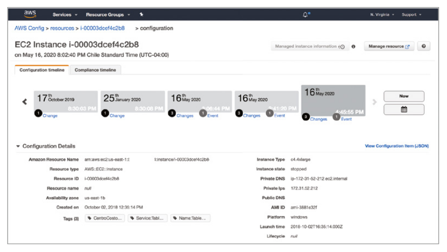

# Detective Controls

An important part of the security cycle is being able to understand what is actually happening in an environment.

Observing when systems fail or perform an undesired action is an important part of an organisation's security posture. In order to infer what is happening with a system, you will need to monitor the system's generated events. This practise is known as *observability*.

All *resources* within an AWS account are observable objects that are continuously changing based upon information they manage (extract, process, store, transmit, analyse, generate, or archive)

Gathering information about the status of your resources and, most importantly, the events they produce is important. These events represent how the resources are changing and how they are interacting with external elements and also among themselves.

To explain the various detective controls, this chapter will follow the *Detective controls flow framework*, outlined below.

The framework is split into four main stages: resources state, events collection, events analysis, and action.

The flow starts with a collection of resources (i.e. the *objects* under observation) and the act of keeping track of its configuration and status over time. A resource can be an AWS resource (i.e. EC2 Instances, API Gateways), external resources (i.e SaaS or custom applications), or AWS Cloud services themselves (i.e. a service reporting the API calls it receives). This resource collection is the first stage, the *resources state*.

Resources will change over time (i.e. due to changes in business requirements, regulatory requirements etc), and such changes or and actions in the environment is referred to as an *event*. Events can occur at any time, and should be recorded as an *observable record*. The second stage, *events collection*, handles the string of events occurring in the environment. Record creation can be either *passive* or *active*. A record is *passively* created when external sources are responsible for sending event notification to the detective control, whereas a record that is *actively* created is on that was created by detective service intentionally looking for information.

Once events have been captured the third stage, *events analysis*, performs analysis upon the records to produce value-added information. The analysis can be perform in several ways, such as comparing the event with a baseline figure; or comparing the event to statistics to determine whether the event is normal, or even leveraging machine learning techniques to identity suspicious operations. 

At this stage, the service can also have a *passive* or *active* posture. A *passive* posture characterises an analysis based on the received observable records, while an *active* posture intentionally gathers additional information from the monitored resources. 

The final result of *events analysis* stage is a repository of observable records, but like in the *events collection* stage, they are a direct
result of an analytical process.

In the *action stage*, it is possible to connect the detection controls with reactive actions, through the use of automation in the cloud. Amazon EventBridge is arguably one of the most powerful tools in the *action stage*, as it is able to connect the source of events with consumers who can respond to those events.

## Stage 1: Resources State

The first stage in the detective framework focuses on knowing the state of the monitored resources. AWS provides tools that assess the current situation of resources at different levels and keep historical track of their state.

### AWS Config

AWS resources inside your account have their own configuration at each point in time. AWS Config is the service that allows you to keep track of the configuration of these AWS resources as well as gather information about monitored resources.

AWS Config allows you to monitor several types of resources inside your account, including compute, serverless, databases, storage, and security, among many others. 

To make use of the monitoring AWS Config offers, you will need to turn on a *configuration recorder* in each AWS region and AWS account that you manage. This component will keep track of *configuration items* (document containing the configuration information of a resource) for the monitored resources, updating the *configuration items* each time a resource is created, updated, or deleted.

Once a configuration recorder has been setup, you can define the resources you want to monitor as a choice between all supported resources or a defined subset of them. The collection of resources is known as the *recording group*. 

The configuration recorder can be started and stopped at any time via the AWS Console or from an API call.

Once the configuration recorder is started, it is in "recording" mode and will track changes of the monitored resources by recording a new configuration item when a change in the configuration is detected, either in the monitored resource itself or in the configuration of any of its related monitored resources (such as a networking interface that is attached to an EC2 instance).

The information gathered from the monitored resources is stored in a construct called the *configuration item*, which is a JSON object that contains the configuration of a resource from the AWS point of view. The JSON file contains the information such as:

- Metadata
- Attributes (including tags, resource ID, resource type, creation time, ARN, and availability zone)
- Relationships
- Current configuration

*Relationships* are descriptions of connections among different resources. For example an Amazon EC2 instance has a relationship with a network interface - for example the network interface is "attached to" the EC2 Instance. Relationships between resources are described as part of the configuration item.

AWS Config provides SQL-like syntax to query information from the current configuration state of a monitored resource, and is known as an advanced query. Additionally, AWS Config can provide a holistic picture of the current configuration, known as a *configuration snapshot*.

A configuration snapshot is a JSON file that contains the current configuration for all the monitored resources. This file is delivered into an Amazon S3 bucket you own, or can be created manually (via the AWS Console) or can be created by scheduling a periodic delivery to occur every 1, 3 , 6, 12, or 24 hours.

As resources change over time, AWS Config (with its configuration recorder on) keeps track of those changes. AWS Config takes a "photo" of the new configuration each time a detected change happens and stores that new configuration in conjunction with information about what caused the change. The sequence of "pictures" for a given resource, is known as a *configuration timeline* (as shown below).

Timeline events can be exposed to the outside world using a *delivery channel*. The delivery channel defines an S3 bucket and an SNS topic that AWS Config uses to deliver information into (such as *configuration snapshots*).

AWS Config also provides a *configuration history*, which is a collection of recorded configuration items that changed over a time period. AWS Config automatically delivers configuration history files every six hours to the S3 bucket configured in the delivery channel.

Additionally, AWS Config can also be provided in a stream, which means being notified as soon as a change is detected. This method is called a *configuration stream* and it uses the topic defined in the delivery channel.

The main goal of AWS Config is to record configuration and changes of the resources and not analyze them. In other words, AWS Config does not judge if a change is good or bad or if it needs to execute an action. Relating to the Detective Framework, AWS Config spans across Stages 1 and 2.

### AWS Systems Manager

AWS Systems Manager (also know as AWS SSM) is a comprehensive service that helps with the administration of large fleets of instances that can be  Amazon EC2 instances, on-premises servers, or even instances running in other cloud providers.

AWS Systems Manager’s capabilities are grouped under these four categories:

- **Operations Management** Refers to the capability of understanding the current state of your environment and how its components are performing. It covers features such as Explorer, OpsCenter, CloudWatch Dashboard, and Personal Health Dashboard (PHD).
- **Application Management** Helps with the administration of applications that are distributed along several components and AWS accounts.
- **Actions & Change** Allows you to specify a sequence of actions to be executed on your managed instances and how to control its execution.
- **Instances & Nodes** Capabilities under this category are oriented to manage instances and nodes at scale.

An *SSM Agent* can be installed directly on a instance and acts as a representative of the SSM service. The SSM agent can support operations such as gathering information directly from the operating system or applications, as well as executing commands within the instance or establishing a terminal instance into the instance (for a user to login to).

The SSM *inventory* features uses the SSM agent to extract metadata (such as installed software and applications), thus enabling the state of these software resources to be tracked. The frequency of collecting data can be configured from within inventory. Once collected, SSM can export into an S3 bucket for further processing, and will update the S3 bucket inline with the configured frequency.

The *resource groups* capability (under the Application Management category) provides you with a better view of AWS resources in your account by grouping them. These groups are created based on common attributes shared by resources such as tags or the
originating CloudFormation stack.

The Operations Management category is entirely applicable to stage 1 of the detective framework. The capabilities grouped under this category (Explorer, OpsCenter, CloudWatch dashboards, and PHD), share in common the fact that they do not create or analyse new information, but provide a central point of view for several operational metrics, like CloudWatch dashboards, a list of created operational tickets (*opsitems*), and the status of PHD checks. 

## Stage 2: Events Collection

### AWS CloudTrail

### Amazon CloudWatch Logs

### Amazon CloudWatch

### AWS Health

## Stage 3: Events Analysis

### AWS Config Rules

### Amazon Inspector

### Amazon GuardDuty

### AWS Security Hub

### AWS Systems Manager: State Manager, Patch Manager, and Compliance

### AWS Trusted Advisor

## Stage 4: Action

### AWS Systems Manager: Automation

### AWS Config Rules: Remediation

### Amazon EventBridge
