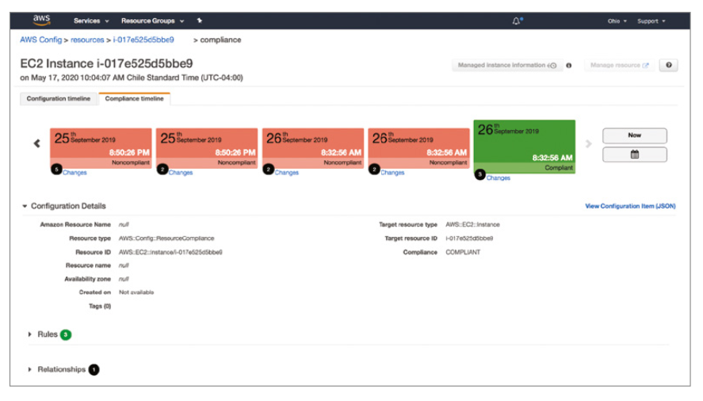

# Detective Controls

An important part of the security cycle is being able to understand what is actually happening in an environment.

Observing when systems fail or perform an undesired action is an important part of an organisation's security posture. In order to infer what is happening with a system, you will need to monitor the system's generated events. This practise is known as *observability*.

All *resources* within an AWS account are observable objects that are continuously changing based upon information they manage (extract, process, store, transmit, analyse, generate, or archive)

Gathering information about the status of your resources and, most importantly, the events they produce is important. These events represent how the resources are changing and how they are interacting with external elements and also among themselves.

To explain the various detective controls, this chapter will follow the *Detective controls flow framework*, outlined below.

The framework is split into four main stages: resources state, events collection, events analysis, and action.

The flow starts with a collection of resources (i.e. the *objects* under observation) and the act of keeping track of its configuration and status over time. A resource can be an AWS resource (i.e. EC2 Instances, API Gateways), external resources (i.e SaaS or custom applications), or AWS Cloud services themselves (i.e. a service reporting the API calls it receives). This resource collection is the first stage, the *resources state*.

Resources will change over time (i.e. due to changes in business requirements, regulatory requirements etc), and such changes or and actions in the environment is referred to as an *event*. Events can occur at any time, and should be recorded as an *observable record*. The second stage, *events collection*, handles the string of events occurring in the environment. Record creation can be either *passive* or *active*. A record is *passively* created when external sources are responsible for sending event notification to the detective control, whereas a record that is *actively* created is on that was created by detective service intentionally looking for information.

Once events have been captured the third stage, *events analysis*, performs analysis upon the records to produce value-added information. The analysis can be perform in several ways, such as comparing the event with a baseline figure; or comparing the event to statistics to determine whether the event is normal, or even leveraging machine learning techniques to identity suspicious operations. 

At this stage, the service can also have a *passive* or *active* posture. A *passive* posture characterises an analysis based on the received observable records, while an *active* posture intentionally gathers additional information from the monitored resources. 

The final result of *events analysis* stage is a repository of observable records, but like in the *events collection* stage, they are a direct
result of an analytical process.

In the *action stage*, it is possible to connect the detection controls with reactive actions, through the use of automation in the cloud. Amazon EventBridge is arguably one of the most powerful tools in the *action stage*, as it is able to connect the source of events with consumers who can respond to those events.

## Stage 1: Resources State

The first stage in the detective framework focuses on knowing the state of the monitored resources. AWS provides tools that assess the current situation of resources at different levels and keep historical track of their state.

### AWS Config

AWS resources inside your account have their own configuration at each point in time. AWS Config is the service that allows you to keep track of the configuration of these AWS resources as well as gather information about monitored resources.

AWS Config allows you to monitor several types of resources inside your account, including compute, serverless, databases, storage, and security, among many others. 

To make use of the monitoring AWS Config offers, you will need to turn on a *configuration recorder* in each AWS region and AWS account that you manage. This component will keep track of *configuration items* (document containing the configuration information of a resource) for the monitored resources, updating the *configuration items* each time a resource is created, updated, or deleted.

Once a configuration recorder has been setup, you can define the resources you want to monitor as a choice between all supported resources or a defined subset of them. The collection of resources is known as the *recording group*. 

The configuration recorder can be started and stopped at any time via the AWS Console or from an API call.

Once the configuration recorder is started, it is in "recording" mode and will track changes of the monitored resources by recording a new configuration item when a change in the configuration is detected, either in the monitored resource itself or in the configuration of any of its related monitored resources (such as a networking interface that is attached to an EC2 instance).

The information gathered from the monitored resources is stored in a construct called the *configuration item*, which is a JSON object that contains the configuration of a resource from the AWS point of view. The JSON file contains the information such as:

- Metadata
- Attributes (including tags, resource ID, resource type, creation time, ARN, and availability zone)
- Relationships
- Current configuration

*Relationships* are descriptions of connections among different resources. For example an Amazon EC2 instance has a relationship with a network interface - for example the network interface is "attached to" the EC2 Instance. Relationships between resources are described as part of the configuration item.

AWS Config provides SQL-like syntax to query information from the current configuration state of a monitored resource, and is known as an advanced query. Additionally, AWS Config can provide a holistic picture of the current configuration, known as a *configuration snapshot*.

A configuration snapshot is a JSON file that contains the current configuration for all the monitored resources. This file is delivered into an Amazon S3 bucket you own, or can be created manually (via the AWS Console) or can be created by scheduling a periodic delivery to occur every 1, 3 , 6, 12, or 24 hours.

As resources change over time, AWS Config (with its configuration recorder on) keeps track of those changes. AWS Config takes a "photo" of the new configuration each time a detected change happens and stores that new configuration in conjunction with information about what caused the change. The sequence of "pictures" for a given resource, is known as a *configuration timeline* (as shown below).

Timeline events can be exposed to the outside world using a *delivery channel*. The delivery channel defines an S3 bucket and an SNS topic that AWS Config uses to deliver information into (such as *configuration snapshots*).

AWS Config also provides a *configuration history*, which is a collection of recorded configuration items that changed over a time period. AWS Config automatically delivers configuration history files every six hours to the S3 bucket configured in the delivery channel.

Additionally, AWS Config can also be provided in a stream, which means being notified as soon as a change is detected. This method is called a *configuration stream* and it uses the topic defined in the delivery channel.

The main goal of AWS Config is to record configuration and changes of the resources and not analyze them. In other words, AWS Config does not judge if a change is good or bad or if it needs to execute an action. Relating to the Detective Framework, AWS Config spans across Stages 1 and 2.

#### Aggregators

An aggregator will pull AWS Config data from multiple account, and show an aggregated view within the aggregator account. 

AWS Config Aggregator will aggregate rules, resources across multiple accounts and regions. If using AWS Organisation it can be configured automatically, without the need to manually link accounts.

Aggregators do not deploy updates into AWS Config rule, it only retrieves the data - to do this, you will need to use AWS CloudFormation Stack sets.

### AWS Systems Manager

AWS Systems Manager (also know as AWS SSM) is a comprehensive service that helps with the administration of large fleets of instances that can be  Amazon EC2 instances, on-premises servers, or even instances running in other cloud providers.

AWS Systems Manager’s capabilities are grouped under these four categories:

- **Operations Management** Refers to the capability of understanding the current state of your environment and how its components are performing. It covers features such as Explorer, OpsCenter, CloudWatch Dashboard, and Personal Health Dashboard (PHD).
- **Application Management** Helps with the administration of applications that are distributed along several components and AWS accounts.
- **Actions & Change** Allows you to specify a sequence of actions to be executed on your managed instances and how to control its execution.
- **Instances & Nodes** Capabilities under this category are oriented to manage instances and nodes at scale.

An *SSM Agent* can be installed directly on a instance and acts as a representative of the SSM service. The SSM agent can support operations such as gathering information directly from the operating system or applications, as well as executing commands within the instance or establishing a terminal instance into the instance (for a user to login to).

The SSM *inventory* features uses the SSM agent to extract metadata (such as installed software and applications), thus enabling the state of these software resources to be tracked. The frequency of collecting data can be configured from within inventory. Once collected, SSM can export into an S3 bucket for further processing, and will update the S3 bucket inline with the configured frequency.

The *resource groups* capability (under the Application Management category) provides you with a better view of AWS resources in your account by grouping them. These groups are created based on common attributes shared by resources such as tags or the
originating CloudFormation stack.

The Operations Management category is entirely applicable to stage 1 of the detective framework. The capabilities grouped under this category (Explorer, OpsCenter, CloudWatch dashboards, and PHD), share in common the fact that they do not create or analyse new information, but provide a central point of view for several operational metrics, like CloudWatch dashboards, a list of created operational tickets (*opsitems*), and the status of PHD checks. 

## Stage 2: Events Collection

The second stage of the detective frameworks is concerned with capturing as many *interesting* events as possible and representing them as records in a repository. It should be noted that deciding as to whether or not an event is good or bad is not performed at this stage.

### AWS CloudTrail

AWS CloudTrail is the service in charge of keeping records of authentication (and unauthenticated) calls into the AWS Cloud. CloudTrail also records non-API events related to service actions and sign-in attempts to the AWS Console, AWS Discussion Forums and AWS Support Centre. CloudTrail is enabled at the creation of an AWS account.

An *event* is a unit of activity recording within CloudTrial, and represents the record that contains the logged activity. Events can be categories as being:

- **Management** events are operations that are performed on AWS resources, or control plan operations, and non-API operations (e.g. sign-in operations)
- **Insight** events are generated by CloudTrail when it detects unusual management API activity (i.e. "meta-events")
- **Data** events are logs of API operations performed within a resource, also known as a data plan operation (e.g. `PutObject` or `GetObject` operations on an Amazon S3 Object)

Each event contains a number of fields and metadata, and provides information about *what* was done (e.g. `requestId`, `eventType`, `resources`), *who* has done it (e.g. `principalID`, `accountId`), as well as *when* (e.g. `eventTime`) and *where* (e.g. `eventSource`, `awsRegion`, `sourceIPAddress`) the event occurred.

CloudTrail also provides the extended functionality of giving awareness on the events, looking for an abnormally high volume of API calls or unusual activity. This functionality is called *Insights* and is available via the AWS Management Console.

Insights are recorded for 90 days, and each event allows for the viewing of the details of the unusual activity, or to view the events as a time series graph. If insights are required for longer than 90 days, the data should be exported to an S3 bucket.

Storing events for longer than 90 days is possible by configuring a *trail.* A *trail* allows you to store CloudTrail events in an Amazon S3 bucket that you own, in the form of *log files*.  A Trail can be enabled on a per-region basis, or for all regions.

Each log file is compressed (in gzip format) and contains one or more JSON-formatted records where each record represents an event. CloudTrail delivers log files several times an hour (about every 5 minutes). Typically the log files for management and data events appear in your S3 bucket within 15 minutes after the activity was executed in the account. Insight events typically appear within 30 minutes after detecting the unusual activity.

Once the records are stored in Amazon S3, you can use services like Amazon Athena and Amazon QuickSight to visualise and analyse them - CloudTrail can configure an Amazon Athena table if required.

CloudTrail integrates with Amazon CloudWatch Logs, Amazon SNS, and Amazon EventBridge to deliver events to these streams. Configuring an Amazon SNS topic for a trail allows you to receive notifications whenever a log file is delivered to the trail’s S3 bucket.

CloudTrail provides both encryption and integrity validation mechanisms. CloudTrail allows you to implement encryption at rest for the records by choosing an encryption method and key at the trail level, by default, log files are encrypted using the Amazon S3 server-side encryption (you can also elect your own KMS key). 

CloudTrail also embeds a trail *integrity validation* mechanism. This mechanism uses asymmetric digital signatures applied to the files delivered in S3 buckets. Using these techniques, AWS CloudTrail protects the records and allows you to determine if a delivered log file was modified, deleted, or unchanged. You can use the AWS CLI `validate-logs` command or a custom method (useful for validating log Giles outside their originally deliver location) to validate the files.

CloudTrail is a regional scoped service, but can be configured to obtain events from different regions in a single trail - known as a multi-region trail. When creating a new trail, you define its scope by choosing the regions the trail covers (options are Current Region or All Regions). All regional logs will be delivered to a single Amazon S3 bucket under a prefix that identified the region they come from. 

Additionally, a trail can also have an *organisations* scope, which will log events from all accounts under the master account.

**Exam Tip:** If a resource has been delete in AWS, investigate using CloudTrail first, as it will be able to provide the details as to who has performed the operation.

#### AWS CloudTrail Insights

AWS CloudTrail Insights helps AWS users identify and respond to unusual activity associated with API calls and API error rates by continuously analysing CloudTrail management events. Examples include monitoring for busts of AWS IAM actions and hitting services limits.

Write events are analysed to detect unusual patterns of behaviour. Anomalies appear in the AWS Console, Amazon S3 or can be sent to EventBridge for further processing.

### Amazon CloudWatch Logs

Amazon CloudWatch Logs allow you to manage the logs produced by systems throughout their lifecycle, in a scalable, highly available, and managed service.

The basic unit of Amazon CloudWatch Logs is *log events* - which are generated by AWS Services, external services or custom applications that are sent to the CloudWatch Logs service using the `PutLogEvents` API. Additionally, the *Amazon CloudWatch agent* can be used to gather logs (both in-guest and custom metrics) from applications running on an EC2 instance

Each log event is a record representing an event reported to the service and contains:

- A ***timestamp*** (date and time when the event occurred) 
- A ***raw message*** (specific data this record is reporting). 

Log events are stored within a *log stream*, which allows you to find records in a time-sequential order. A number of log streams can be hierarchically grouped into *log groups*.

Data stored within a log group can be encrypted, by linking a Customer Master Key (CMK). CloudWatch will automatically encrypt data it stores using the CMK and decrypt it when users access the data using the same CMK.

By default, there is a retention limit for logs, but this can be configured for between 1 and 3,653 days (10 years).

Querying data can be accomplished using Amazon CloudWatch Logs Insights service, which provides query syntax to apply to one or more (up to 20) log groups. CloudWatch Logs will automatically discover the data fields of AWS services logs and any JSON-based logs.

Summarising information from logs can be completed using the *metric filter* feature as part of Amazon CloudWatch Logs. A metric filter extracts information from an event log and converts it into a number to be plotted in a time series representation. Once the data has been extracted, it can be used to create a *metric*.

A *metric* will report a number to Amazon CloudWatch to store and plot its value, with the metric being aggregated and reported on a per-minute basis. You can also establish a default metric value, i.e. the number to be reported for each log event that does not match the filter.

Specifically, by creating metric filters on top of log groups receiving events from AWS CloudTrail, you can monitor and alert according to the number of occurrences of any event reported in a trail.

For exposing the records in a stream-like fashion, Amazon CloudWatch Logs provide another mechanism: *subscriptions*. In a subscription, Amazon CloudWatch Logs produce a near real-time stream of events and deliver them to a consumer, such as Amazon Kinesis Data Streams, Amazon Kinesis Data Firehose or an AWS Lambda Function.

### Amazon CloudWatch

Amazon CloudWatch as a *metric repository* service whose function is to record information in a time sequence by storing a number (metric) for each period of time. Amazon CloudWatch receives data either from AWS services or custom data sources (custom metric).

Each ingests source define a *namespace*, a metric *name*, and (optionally) metric *dimensions* to group the information. Each metric can be setup as either:

- **Standard** resolution stores data with a one-minute granularity (default setting)
- **High** resolution stores data with a one-second granularity (only available for custom metrics)

Amazon CloudWatch retains the metrics for up to 15 months, aggregating data of higher resolution as that data becomes older.

Amazon CloudWatch metrics can be consumed in a stream-like way by configuring *alarms*. Alarms are defined thresholds for a specific metric. Once a metric crosses the threshold for a custom-defined number of times, the alarm is triggered. You can configure actions to execute and notifications to send (via an Amazon SNS topic or a specific email addresses) when an alarm is triggered.

### AWS Health

AWS Health provides you with information about issues, notifications, or scheduled changes in the underlying infrastructure that could affect your AWS account.

The *Personal Health Dashboard* (PHD) highlights the most recent issues and notifications, along with upcoming changes. An *event log*  is also provided which lists the events reported within the past 90 days. The event log API is only available for accounts that have subscribed to business or enterprise support plans.

### VPC Flow Logs

VPC Flow Logs enables you to capture information about the IP traffic going to and from network interfaces in your VPC. Flow log data can be published to Amazon CloudWatch Logs, Amazon S3, or Amazon Kinesis Data Firehose.

### ELB Access Logs

Elastic Load Balancing provides access logs that capture detailed information about requests sent to your load balancer. Each log contains information such as the time the request was received, the client's IP address, latencies, request paths, and server responses. 

Access logs are disabled by default when using Elastic Load Balancing. Access logging can be enabled at any time, in which logs are delivered to an S3 bucket.

### CloudFront Logs

CloudFront can deliver access logs into an Amazon S3 bucket that can can then be analysed by Amazon Athena.

### WAF Logs

WAF LOgs can be enabled tp obtain information about the time that AWS WAF received a web request from your AWS resource, detailed information about the request, and details about the rules that the request matched. 

You can send your logs to an Amazon CloudWatch Logs log group, an Amazon S3 bucket, or an Amazon Kinesis Data Firehose.

## Stage 3: Events Analysis

After collecting the events, the next step is to analyse them in order to produce a list of “processed” events (or findings). 

### AWS Config Rules

AWS Config tracks configuration items of your monitored resources, and is notified when a change happens. This notification allows the service to establish if the change leaves the resource in a compliant or non-compliant state. 

Deducing if a resource is compliant is accomplished by one or more AWS Config rules. 

There are three types of AWS Config rules:

- **Custom rules** trigger a custom AWS Lambda function your create and maintain. AWS Config will pass details about the monitored resource to the function, and the function should return whether or not the resource is compliant.
- **Managed rules** are a variety of predefined rules that you do not have to create yourself
- **Service-linked** rules are rules that are provided by AWS services. These rules cannot be edited, and are considered good practices as defined by AWS service development teams

An AWS Config rule can be configured to be triggered in three ways:

- On a *periodic basis* (every 1, 3, 6, 12 or 24 hours)
- When a *configuration change* is detected (a continuous audit of your monitored resources)
- *on-demand* basis via an API call or the Management Console

Rules can be resisted to run on certain resource types or via resource tags.

AWS Config keeps a record of the rules' execution, along with each of the resource's reported status (either compliant or non-compliant). It is possible to view the aggregated state of a rule (i.e. the status of all it's target resources), or from the point of the resource (a resource will likely have multiple rules targeting it).

AWS Config provides a *compliant timeline* that shows the compliance status of a resource over time, as shown below.

AWS Config is able to delivery notifications of when a rule is applied to a resource and when the compliance status of a resource changes if there has been a defined Amazon SNS topic.

AWS Config is a region service, but can aggregate data across regions and accounts if configured.

### Amazon Inspector

Amazon Inspector evaluates the security status of an Amazon EC2 instance by providing insights into security issues or vulnerabilities. The service gathers information at the network level (*network assessments*) and/or directly from the instance (*host assessments*) via the SSM agent.

*Rules packages* inside Amazon Inspector are collections of predefined security checks (*rules*) to evaluate against an EC2 instance. Each rule has an assigned severity level (high, medium, low, or informational).

An *assessment target* is a list of Amazon EC2 instances that may exist in any region, and in the same account or different accounts (via AWS Organisations). Additionally subset of all instances within an account/region can be defined through the use of a key-value tags on the instances.

An *assessment template* defines which rule packages run on which assessment target. An assessment template can be executed as many times as required, but is usually done so on a periodic basis. The results from each execution are stored within the *assessment run* as a JSON file. The results contains details such as its severity, the date of discovery, description and recommendations on how to deal with it.

For each assessment run, you can generate a documented report (in either PDF or HTML format) with findings information. Additionally, an Amazon SNS topic can be defined within the assessment template, which will receive notification when a finding is ported and when an assessment starts, finishes or changes its state.

Additionally, scans are run on ECR registries as well as Lambda functions are analysed for software vulnerabilities.

All reported findings are sent to Security Hub (or Event Bridge).

### Amazon GuardDuty

Amazon GuardDuty analyses selected logs from AmazonVPC Flow Logs, AWS CloudTrail, DNS queries (those that are resolved within the VPC), Kubernetes Audit Logs and cryptocurrency attacks. Once analysed, suspicious events are reported as *findings*.

Amazon GuardDuty does not require you to enable VPC Flow Logs, create a trail in AWS CloudTrail, or even configure an Amazon Route 53 zone, as it will automatically gather information from these services, without affecting the performance of your applications.

Amazon GuardDuty’s analysis is based on threat intelligence information (such as IP addresses and domain-based lists) as well as machine learning models. Custom lists of *trusted IPs* and of malicious IPs (*threat lists)* can also be created. Activity from IP addresses on a trusted IP list will not generate any findings.

The basic entity in Amazon GuardDuty is called a *detector*, which consumes information and generates findings within a specific AWS account and region. Once a *detector* is enabled, Amazon GuardDuty starts reporting findings. A finding contains several attributes such as ID, time of the finding, severity, finding type, affected resources, and action details. The example image below, shows a Trojan that is trying to contact domains that are known to be bad actors.

Amazon GuardDuty also allows you to automatically export findings to an S3 bucket you own. Amazon GuardDuty will export *active* findings (findings matching suppressed rules will not be exported) within five minutes of its first occurrence. If an active finding receives recurrent events, you can configure how frequently those events are reported (every 15 minutes, every hour, or every six hours).

Amazon GuardDuty adheres to the concept of a *master* account. The master account receives findings from other (*member*) accounts and has the capability to manage (enable, disable, or suspend) the detectors, manage the findings workflow (archive and create suppression rules), and configure threat lists for those member accounts. Additionally, GuardDuty supports AWS Organisation, allowing for it to be enabled as part of a multi-account strategy.

**Exam Tip:** GuardDuty is the only AWS Service that can help to prevent Cryptocurrency attacks.

**Exam Tip:** If GuardDuty is active but is not producing any DNS-based findings, then it is likely because the default DNS resolver is not being used.

### AWS Security Hub

AWS Security Hub is a service that consolidates security information about your AWS resources and presents it in a single pane. AWS Security Hub receive information from multiple AWS services, such as Amazon GuardDuty, Amazon Inspector, Amazon Macie, AWS Firewall Manager, and IAM Access Analyser, as well as third-party security products, or from your own applications. *Note: you must enable AWS Config of this service to work!*

AWS Security Hub relies on the concept of *security standards* (i.e. best practises) when gathering information from the accounts. The service compares the current environment status with the security standards to establish a verdict of compliance for each of the security standards.

Checks can be executed when a change is detected or scheduled - AWS Config must support the resource type in order for check to be performed when changes are detected, otherwise Security Hub will check no later than 12 hours after the last execution.

AWS Security Hub also provides a process called a *workflow* to manage the findings, which describes a series of stages in which a finding can be positioned at any point in time. Each finding has a status, that can be one of: New, Notified, Suppressed, or Resolved. The workflow status can be modified at any time, allow for your own process to deal with the security findings.

Along with findings, AWS Security Hub presents an additional view to consume the information via *insights*. Insights are filters and groupings that allow you to see affected resources in groups to facilitate the human analysis. 

AWS Security Hub has a regional scope, so you need to enable it on every region where you want to use its capabilities. Additionally, the service adheres to the master-member concept, allowing other accounts to accept an invite to join the master account. The master can view findings from the member accounts, as well as election actions on those findings.

GuardDuty can send findings into Security Hub, and will be automatically converted into a Security Hub Finding. Audit Manager and Amazon Detective can also receive data from Security Hub.

Security Hub can forward it's findings on to EventBridge, for further automated processing using other AWS Services and/or 3rd party solutions.

### Amazon Detective

Amazon Detective enables you to investigate, analyse, and identify root causes of security issues or suspicious activities in your AWS environments. Amazon. Detective does this through the automatic collection of log data from AWS resources such as VPC flow logs, AWS CloudTrail, and Amazon GuardDuty.

**Exam Tip:** Amazon Detective can detect if Cloud Logging was disabled and by using ML, it can detect which systems may have been compromised. 

### AWS Systems Manager: State Manager, Patch Manager, and Compliance

These three capabilities of AWS Systems Manager - State Manager, Patch Manager, and Compliance - are categorised under the group *instances & nodes* of the service.

*State Manager* and *Patch Manager* capabilities work by specifying the desired state of a managed resource (by documenting a set of desired parameters) and constantly act to keep the fleet adhering to that state. 

*Compliance* capability shows you the current adherence status both for State Manager and Patch Manager.

State Manager establishes the instance’s desired state and the actions to bring the instance to that desired state. This information is included inside an SSM *document*, for example you can use an AWS SSM document to check if an antivirus is installed and updated. If the two conditions are fulfilled, the system is marked as compliant.

Patch Manager is designed to keep instances and nodes in the desired state regarding OS and application patches. Patch Manager uses a *patching configuration* document that contains information about the desired state for patching a list of target instances. Additionally, Patch Manager can also be used to assess if the patches are up-to-date. 

The SSM *Compliance* capability offers an overview of the status of the monitored instances according to the *patch* and *status* compliance definitions. So, with Patch Manager and State Manager, you define your desired state and constantly compare it with the current state of your monitored resources; with Compliance you have easy access to that information to quickly understand your current situation.

### AWS Trusted Advisor

AWS Trusted Advisor provides a list of checks that compare your current account status with a set of good practices grouped under four categories: security, cost optimisation, reliability, and performance. Trusted Advisor will also monitor how close your are to reaching your account's service limits.

Accounts that have a Business or Enterprise support plan will receive additional Trusted Advisor capabilities such as unrestricted access rules in security groups, to whether AWS IAM is enforcing a password policy

AWS Trusted Advisor keeps a list of observations about how you can improve your environment, which can be viewed via the AWS Console.

## Stage 4: Action

*Remediation* can be defined as acting on (or reacting to) an observation as a way of improving security posture. While the tools highlighted in this section are not strictly part of the AWS detective controls, they do offer a smooth association with remediation actions.

### AWS Systems Manager: Automation

The AWS SSM automation capability makes use of the SSM *automation* documents, which describe a series of tasks to execute against a target list of resources. The AWS SSM automation capability runs these tasks on several resources at the same time.

### AWS Config Rules: Remediation

When AWS Config Rule executes a check the service can link the execution to a remediation action, if the resource is reported as being non-compliant. As part of the Config Rule configuration, you can point to an SSM Automation action already defined in your account, along with any parameters required to execute the automation, and execution retires. Additionally you can configure that the remediation action is executed immediately, or keep it for on-demand triggering - useful if you wanted to execute such changes during a change window.

There are over 150 AWS Managed Config rule that can be used, or alternatively, you can create custom remediation actions using AWS Lambda Functions. 

Additionally AWS Config can execute an SSM document as part of it's remediation, for example AWS Config can monitor if any of the AWS account's IAM Access keys have expired, and if so, the SSM Document `AWSConfigRemediation-RevokeUnusedIAMUserCredentials` could be executed, which would disable the expired credentials.

An SNS topic can be configured against AWS Config Rules to forward event to an Admin to review if a resource is no long compliant.

### Amazon EventBridge

Amazon EventBridge delivers a stream of events representing changes to resources (usually within an AWS account, but it can also extend to external resources).

Amazon EventBridge provides the option to set up event buses, that can be used to receive events from external sources (like SaaS partners or custom applications). Each event bus can be configured with rules to match a specific event, and forward it onto other services for processing, such as Lambda.

The image below depicts the overflow of events through Amazon EventBridge. The process starts with the ingestion of events (i.e. changes in resources) into an event bus, which in turn can trigger actions as a response to selected events (you select the events defining a rule with a matching filter).

***Note:** The default event bus automatically receives events from AWS resources, and is created automatically when your AWS account is setup. The default event bus can be used by custom applications and other AWS accounts, and it cannot be deleted it because it is part of the Amazon EventBridge infrastructure.*

Other AWS services like Amazon GuardDuty and AWS Security Hub rely on Amazon EventBridge to provide access to their findings in a stream-like structure.
