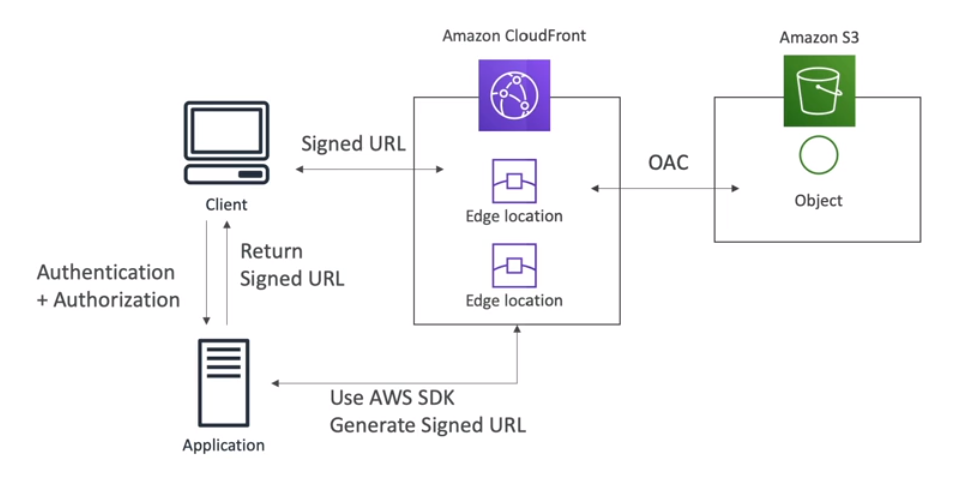
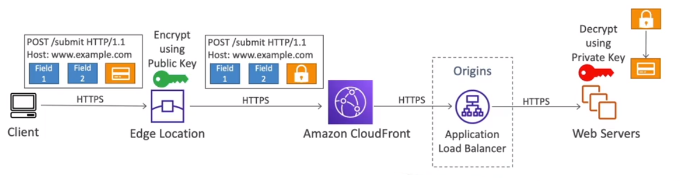

# Infrastructure Protection

## AWS Networking Constructs

### VPC

Amazon Virtual Private Cloud (Amazon VPC) is an abstraction that represents a virtual network within the AWS Cloud. Each VPC is associated with an AWS region, and therefore VPCs do not extend beyond a region.

A VPC consists of at least one range of contiguous IP addresses — i.e. a Classless Inter-Domain Routing (CIDR) block

Any IP range can be used for a VPC CIDR but it best to use one of the following RFC1918 ranges to avoid conflicts with public Internet addresses:

- `10.0.0.0 – 10.255.255.255 (10.0.0.0/8)`
- `172.16.0.0 – 172.31.255.255 (172.16.0.0/12)`
- `192.168.0.0 – 192.168.255.255 (192.168.0.0/16)`

A VPC can configured with two tenancy types:

- **Default**: Amazon EC2 instances that are deployed in this VPC will share hardware with other AWS accounts.
- **Dedicated:** Amazon EC2 instances deployed in a dedicated VPC will run on hardware dedicated to a single tenant (i.e. a single AWS Account)

The choice between either option depends on various factors such as compliance regulations or existing software license specifics

### Subnet

A *subnet* represents a range of IP addresses in your VPC. Resources that are deployed into a subnet will inherit traffic policies that are applied to the subnet. A subnet is located within a single AZ.

Not all IP Addresses with a subnet are assignable, three IP addresses are reserved for AWS usage:

- **Second Address** is reserved for the VPC router (i.e. 10.0.10.1) 
- **Third Address** is reserved for the DNS server (i.e. 10.0.10.2) 
- **Fourth Address** is reserved for future use (i.e. 10.0.10.3) 

Each subnet will have an associated Route Table, in which routing rules can be added. By default, all routing tables will provide a routing mechanism for resources within the subnet.

### Internet Gateway

An Internet gateway is a scalable, redundant, and highly available VPC component that allows communication between instances in your VPC and the Internet.

There are two types of Internet gateways in the AWS Cloud:

- **Internet Gateways** provide a target in your VPC route tables for Internet-routable traffic (default route). They also perform network address translation (NAT) for instances that have been assigned public IPv4 addresses, and they support IPv6 traffic.
- **Egress Only Internet Gateways** are only used to enable outbound IPv6 traffic from the VPC.

Internet gateways are attached to a VPC, and can be used by multiple subnets. In order for a subnet to use an Internet gateway, a default route pointing to the Internet Gateway will need to be setup, e.g. `0.0.0.0/0` would point to the Internet Gateway

## Network Address Translation

Network Address Translation (NAT) is a mechanism to map one (or more) private IP Addresses to a single public IP address before transmitting the request out to the internet.

The purpose of a NAT device is to allow an instance to access the Internet while preventing hosts on the Internet from reaching the instance directly.

### NAT Gateway

- A NAT gateway is a NAT device managed by AWS - it scales to accommodate your bandwidth requirements
- A NAT gateway must be assigned an EIP, and can only reside in only one subnet. It is possible to deployment NAT gateways in multiple subnets across AZs for redundancy.
- After creating a NAT gateway, you must create a default route to direct Internet-bound traffic from your instances to the NAT gateway
- Because a NAT gateway doesn’t use an ENI, you can’t apply a security group to it. You can, however, apply an NACL to the subnet that it resides in.

### NAT Instance

- A NAT instance is a normal EC2 instance that uses a pre-configured Linux-based AMI, however there are some differences to a NAT Gateway:
  - A NAT instance doesn’t automatically scale to accommodate increased bandwidth requirements (if its not correct, you need to manually upgrade to a larger instance)
  - It is not possible to have multiple NAT Instances (e.g. using a auto-scaling group)
  - You also must remember to assign it a public IP address
  - You must disable Source/Destination checks on the NAT instance so that it can handle packets that were not originally destined for the NAT instance.
  - A NAT instance will need a security group associated to it, which will need to be changed accordingly when new resources are added into subnets. 
- NAT instances do have some advantages, such as:
  - Being configured as a bastion host to connect to instances that don’t have a public IP.
  - Custom port forwarding rules can be configured, such as sending traffic on port 8000 to a private server listening on port 9000
- NAT gateways are considered more appropriate and secure for enterprise-class designs apart from the circumstances outlined above.

## Security Groups

A *security group* is a virtual firewall that controls inbound and outbound traffic on an elastic network interface (ENI). Each rule can be defined in terms of IP addresses, transport protocols (TCP or UDP), and ports that will define which type of communication your instance can receive or transmit.

The source or destination in a rule can be any CIDR, and the source can also be the resource ID of a security group. Each security group contains a hidden rule that will denies every connection that is not defined in previous rules. The ordering of rules within a security group, does not affect the evaluation.

Security groups are *stateful*, which means that return traffic from an allowed inbound connection is automatically permitted to leave the instance, i.e. you do not have to define a corresponding outbound rule to allow it.

Each ENI can support up to five security groups per network interface. When multiple security groups are attached to the same ENI, the rules from each security group are effectively aggregated to create a unique set of rules as if they belonged to a single security group.

Security Groups can also reference prefix lists, which are a list of destinations that can be centrally updated, for example AWS provides these for it's services such as S3 and DynamoDB.

**Exam Tips:** When modifying a Security Group, existing connection will be left alone until they timeout or the session is closed. If you need to force the closing of the connection, you can temporarily apply the same rule onto the NACL which will kill the session. For example, when disabling ssh, to force kill all active connections, you can update the security group and the NACL - with the latter killing the connection immediately.

## Network Access Control Lists

Network access control lists (NACLs) are network traffic control objects that act as firewalls when traffic enters or leaves a subnet in your VPC. The extra layer of traffic filtering can be used to prevent unexpected traffic between subnets, regardless of what is deployed in the subnets.

A subnet can only have one NACL associated with it, and by default the VPC's default NACL is used if a NACL is not specified when creating a subnet. Each VPC has a default NACL that cannot be deleted.

A NACL is stateless, meaning that it doesn’t use connection tracking and doesn’t automatically allow reply traffic — you'll often need to explicitly open Ephemeral ports for example.

Rules within a NACL are evaluated starting with the lowest numbered rule, when a rule matches traffic, it is immediately applied independently of any higher-numbered rule that may contradict it.

**Exam Tips:** When modifying a NACL, the change is applied straight away, ie all active connection that are affected by the rule change will be killed. 

## Elastic Load Balancing

AWS offers three types of load balancing services under the name *Elastic Load Balancing*: *Application Load Balancer*, *Network Load Balancer*, and *Classic Load Balancer*.

Each type of Elastic Load Balancing implementations follow the same basic architecture:

- **Target** represents instances or IP Addresses (as well as the protocol and port)  from AWS resources that will receive the connections that the load balancer is dispatching.
- **Health Checks** synthetic requests that verify whether an application is available to accept connections. These requests can accept HTTP/HTTPS, TCP, TLS and UDP.
- **Target Group** is a group of instances, IP Address or AWS Lambda functions that deploy the same application, user the same health check and are balanced via a load-balancing algorithm such as *round robin* or *least outstanding requests* (uses the target with the fewest connections)
- **Listener** is an entity that checks for connection requests from clients, using the configured protocol and port - this is informally known as a virtual IP (VIP).
- **Stickiness** is an optional feature that ensures a user's session is bound to a specific target, ensuring that all requests from the user are handled by the same target. The stickiness can have a duration of between one second and seven days.

Additionally, all types of Elastic Load Balancers support Amazon CloudWatch metrics, logging, availability zone fail-over, cross-zone load balancing, SSL offloading, and backend server encryption.

### Application Load Balancer (ALB)

An ALB operates at levels 5 to 7 of the OSI model, and are defined to load-balance web traffic. An ALB can also be used to improve the security of application by ensuring that the latest ciphers and protocols are used.

An ALB provides additional functionality such as:

- slow start (to avoid target overload when they are included in a target group)
- Source IP address CIDR-based routing
- Routing based on parameters such as path, host, HTTP header and method, query string
- Redirects and fixed responses

ALB supports AWS Lambda functions as targets as well as user authentication.

ALB does not support UDP or TCP directly - you will need to use an NLB for this.

### Network Load Balancer (NLB)

An NLB operates at level 4 of the OSI model, routing connections based on IP and TCP or UDP protocol data. It is capable of handling millions of requests per second while maintaining ultra-low latencies. 

An NLB provides additional functionality such as:

- the use of static IP address or you can use an elastic IP address (doesn't support DNS)
- preservation of the client source IP address (for logging purposes)

NLBs only support EC2 instances, private IPs or ALBs as target types.

#### Client IP Preservation

Client IP address can be forwarded onto the Network Load Balancer targets, when the Client IP preservation has been turned on. 

When enable, you need to ensure that any Security Groups and NACLs have been updated accordingly.

#### Security Groups

NLBs can have a security group attached to them directly (as well as the targets). This allows the Security Groups of the targets to accept traffic from the Security Group of the NLB (similar to how ALBs work).

### Classic Load Balancer (CLB)

A CLB enables basic load balancing across Amazon EC2 instances. A CLB is intended for applications that were built within the EC2-Classic network. 

Exclusive CLB features include the support of the EC2-Classic platform as well as custom security policies.

### SSL Certificates

An SSL certificate allows traffic between your clients and your load balancer to be encrypted in transit. Public SSL certificates are issued by a Certificate Authorities (CA), such as Comodo, Symatec GoDaddy, DigiCert etc. 

An ELB will have a certificate assigned to it, so that it will decrypt the encrypted traffic, and forward this information to the target groups, over the private VPC.

When configuring a HTTP ELB listener, you must specify a default certificate, but can you optionally provide additional certificates to support multiple domains.

Alternatively, Client can use the Server Name Indication (SNI) protocol to specify the hostname they intend to reach. SNI is a new protocol that requires the client to indicate the hostname of the target server in the initial SSL Handshake. The server will then find the correct certificate, or return the default one. SNI only works for ALB, NLB and CloudFront.

Public SSL certificates can be managed by AWS Certificate Manager.

### SSL Listener Security Policy

A Security Policy is a combination of SSL protocols, SSL ciphers and Server order preference options supported during SSL negotiations.

You can use predefined security policies and apply them to the ALB and NLB, such as enforcing TLS 1.3.

## API Gateway

API Gateways support Resource policies, which can be used to restrict which IPs can access Public API Gateways.

Private API Gateways can only be accessed from within a VPC, but you should still add `SourceVPC` as a condition on the Resource policy to restrict this further.

There is a limit of 10K requests per second across all API Gateways deployed in an Account - this limit can be increased, but it is a per account limit, not per API Gateway.

**Exam Tip:** Account A can call a Private API Gateway deployed in Account B via a VPC interface - you do not need to use VPC Peering

## VPC Endpoints

*VPC endpoints* allow for private connections to AWS services from within your VPC, without imposing additional traffic on your Internet gateways or relying on the Internet for such communication. 

There are two types of VPC endpoints:

- **Gateway endpoint** is a gateway that you specify as a target for a route in your route table for traffic destined to AWS services such as Amazon S3 and Amazon DynamoDB
- **Interface endpoint** is an elastic network interface with a private IP address on a subnet that serves as an entry point for traffic between this subnet and AWS services (such as EMR, ECS, KMS etc).

### VPC Endpoint Policy

A VPC Endpoint policy controls which AWS principals can use the VPC endpoint to access AWS services. VPC Endpoint policies can be attached to VPC Gateways and Interfaces. This is useful, for when you are looking to restrict certain users or services from making networking calls to other services.

*Note: this does not override the security policies on the target resource, such as S3 Bucket Policies.*

## VPC Flow Logs

VPC *flow logs* enables the capturing of flow information (which includes IP addresses, transport protocol, and ports) about the traffic going to and from network interfaces in a VPC.

A flow log can be created for a VPC, subnet or an individual network interface - logging for a VPC or subnet will monitor each network interface in that VPC or subnet. Flow logs can be sent to either Amazon Cloud Watch Logs or Amazon S3.

Flow logs can be created for network interfaces that belong to AWS services (so long as they are deployed in a VPC you manage), for example Elastic Load Balancing, Amazon RDS, Amazon ElastiCache, Amazon Redshift, NAT gateways and transit gateways.

When creating a flow log, the following parameters will be required:

- **Filter** specifies which records are recorded, can be either All, Rejected Only or Accepted Only
- **Maximum Aggregation Interval** specifies the time interval during which a flow of packets is captured and aggregated into a flow log record
- **Destination** specifies where the logs are to be stored, can be either Amazon CloudWatch Logs or Amazon S3
- **IAM Role** specifies the role that has the permission to publish the logs into the destination.

*Note: traffic is not captured for Amazon DNS queries, Windows License Activations EC2 instance Metadata (i.e. 169.2354.169.254), DHCP traffic or mirrored traffic.*

## VPC Network Analyzer

Amazon VPC Network Access Analyzer helps you identify network configurations that lead to unintended network access.

VPC Network Analyzer evaluates requirements against network resources within a VPC, and can be used to demonstrate compliance, for example proofing that here are not publicly accessible resources within a VPC.

In order to utilise this, you will need to create a Network Access Scope JSON document, that defined certain conditions regarding your network security policy.

## AWS Private Link

AWS PrivateLink provides private connectivity between VPCs, supported AWS services, and your on-premises networks without exposing your traffic to the public internet. Interface VPC endpoints, powered by PrivateLink, connect you to services hosted by AWS Partners and supported solutions available in AWS Marketplace.

This approach does not require VPC peering, which would open access to the entire network, and has limits to the number of connections allowed.

Private Link does not require a NAT, Internet Gateway or IP Tables to be updated.

## AWS Transit Gateway

AWS Transit Gateway connects your Amazon Virtual Private Clouds (VPCs) and on-premises networks through a central hub.

All connected VPCs can talk to each other if configured (unlike VPC peering).

The Transit Gateway route tables define which VPCs can communicate with the Transit Gateway.

### Transit Gateway ECMP

Equal-Cost, Multipath is a routing strategy that allows for packets to be routed of multiple best paths.

The main use case is to create multiple site-to-site VPN connections to increase the bandwidth and available of your connection to AWS.

### Amazon CloudFront

AWS CloudFront integrates with Shield and WAF for DDoS protection.

When using CloudFront and S3, you should always be using Origin Access Control (OAC), which is the replacement of Origin Access Identity (OAI).

### Geo Restriction

You can create an Allow/block list of countries that cannot access the CDN

The most common use case is to control copyright requests

### Signed Url & Cookies

Signed URLs/Cookies allows certain users to access your content.

Each signed URL (or cookie) must be generated with details of the IP ranges to access the data from and the url expiration.

A Signed URL can only prove access to individual files, i.e. one signed url per file, where as a Signed Cookie allows access to multiple files, i.e. one signed cookie for many files.

To add a CloudFront key-pair you must use the root account, and this is not recommended. Alternatively, you should setup a trusted key group which supports rotating keys and the management of key groups is achieved via IAM policies.

After a key-pair has been created, the application will use the private key to sign a request, and CloudFront will verify the request using the public key.

#### CloudFront Signed URL vs S3 Pre-Signed URL

CloudFront signed urls works with all cloudfront origins, such as ELB, Api Gateway etc. It also supports caching of the content, and uses an account-wide key-pair which is managed by the root account.

S3 Pre-signed URLs are issued as the perform for generated the pre-signed url (i.e. not able to be shared with other users), as well as having a limited time span and no caching support.

### Field Level Encryption

Field Level Encryption can be used to encrypt (up to 10 fields) at the edge location as part of a HTTP POST request to a CloudFront-fronted service. 

This ensures that data (such as credit card information), is encrypted at the edge location, and hence is passed to CloudFront, and onto the ALB completely encrypted. The origin server will need to decrypt the data once it has received the encrypted data.

### Origin Access Control (OAC)

OAC supports SSE-KMS natively, but to you will need to add CloudFront to the KMS key policy in order for it to be used,

OAI is no longer recommended, as it only supports SSE-S3 encryption.

### Exam Tips

One scenario that comes up is to prevent users from directly accessing the origin ALB or custom servers.

The solution is to configure CloudFront to add a custom header and a secret value to each request, such as `X-MY-HEADER: MY-SECRET`. The origin ALB should only accept requests, if the custom header and value is present.

Another Scenario involves CloudFront and Cognito - to protect the origin servers, you can use Lambda@Edge to validate the Cognito JWT token, the JWT token is valid, then the request can be forwarded onto the origin servers, otherwise it can be rejected.

## AWS Web Application Firewall

AWS Web Application Firewall (AWS WAF) protects your web applications and APIs from known IPv4 and IPv6 web attacks. You can create rules that block well-known attacks such as SQL injection and cross-site scripting, or specific traffic patterns that you can define.

AWS WAF supports filtering any part of the web request, including IP addresses, HTTP headers, HTTP body, and request URI. In order to filter requests, a Web Access Control List (Web ACL) must be defined and associated to the AWS WAF.

A Web ACL can contain your own rules or *managed rule groups*, which are pre-configured rules defined by AWS or AWS Marketplace sellers. Each group has a defined *capacity unit*, and a Web ACL has a limit of 1,500 capacity units.

A custom rule can be created, and can be configured to match on any number of properties within the request, and can support additional transformations such as URL decoding, compressing white space or replacing HTML encoded entities. Each rule can be confirmed to Block, Allow or Count the request (in which case the matches would be counted).

AWS WAF offers near real-time visibility into your web traffic, allowing you to create new alerts in Amazon CloudWatch.

WAF Logs can be sent to CloudWatch or S3 buckets, as well as Kinesis Data Firehose.

AWS WAF does not perform DDoS protection - this is AWS Shield!

## AWS Shield

Distributed denial-of-service (DDoS) can be defined as cyberattacks in which many different compromised sources generate traffic intended to make a computer or network resource unavailable to its originally intended users.

AWS *Shield* provides constant detections and automatic inline mitigations that minimise application downtime or performance degradation against DDoS attacks at two different levels: *AWS Shield Standard* and *AWS Shield Advanced*.

### AWS Shield Standard

AWS *Shield Standard* is a no-cost version that defends your environment against the most common Network (Layer 3) and Transport (Layer 4) known infrastructure attacks when you use Amazon CloudFront and Amazon Route 53. 

It uses network flow monitoring, a combination of traffic signatures, anomaly algorithms, deterministic packet filtering, and priority-based traffic shaping to detect attacks. AWS Shield Standard is activated by default in all AWS accounts.

### AWS Shield Advanced

AWS *Shield Advanced* enables additional detection and mitigation against larger and more sophisticated DDoS attacks on Amazon EC2, Elastic Load Balancing, Amazon CloudFront, AWS Global Accelerator, and Amazon Route 53.

AWS Shield Advanced provides the following distinct features:

- **Near real-time visibility and reporting**  Layers 3 and 4 attack notifications and attack forensic reports are available, as well as Layer 3, 4, and 7 attack historical reports.
- **Integration with AWS WAF** incidents can be responded to as they occur via customisable rules that you can deploy instantly in AWS WAF to quickly mitigate attacks.
- **24/7 access to the AWS DDoS Response Team (DRT)** for manual mitigation of edge cases affecting your availability such as custom rules intended to mitigate application layer DDoS attacks in your environments.
- **Cost protection** reimbursements will be applied to you account due to DDoS-related cost spikes relating to Amazon EC2, Elastic Load Balancing, Amazon Route 53, Amazon CloudFront, and AWS Global Accelerator.

Additionally, AWS Shield Advanced provides a number of CloudWatch Metrics to help deduce if there is a DDoS attack currently happening:

- `DDoSDetected`
- `DDoSAttackBitsPerSecond`
- `DDoSAttackPacketsPerSecond`
- `DDoSAttackRequestsPerSecond`

AWS Shield Advanced is not activated by default, and has an estimated cost of $3,000 per month (with a 12-month commitment).

## AWS Firewall Manager

AWS Firewall Manager is a security management service that allows you to centrally configure and manage firewall rules across your accounts and applications in AWS Organisations.

AWS Firewall Manager allow for the application of a standard set of policies across multiple services including:

- WAF Rules
- AWS Shield Advanced
- Security Groups
- AWS Network Firewall
- Amazon Route 53

All policies that are applied, are regional based - i.e. not global.

## WAF vs Shield vs Firewall Manager

- WAF is for granular protection of resources via the Web ACL definitions
- Shield adds an extra layer of protection, including DDoS protection
- Firewall Manager automates the protect of new resources

## AWS Network Firewall

AWS Network Firewall allows you to define firewall rules that provide fine-grained control over network traffic that enters or leaves your network.

It operates at layers 3 - 7 and rules can be centrally managed across multiple accounts.

Rules can be set to allow, deny or alert on traffic matches, with all matches being forwarded to S3, CloudWatch Logs or Kinesis Data Firehose.

**Exam Tip:** GuardDuty can report findings into Security Hub, which can trigger a Lambda function to update Network Firewall rule(s) to prevent traffic from entering/leaving the VPC (a common exam question).