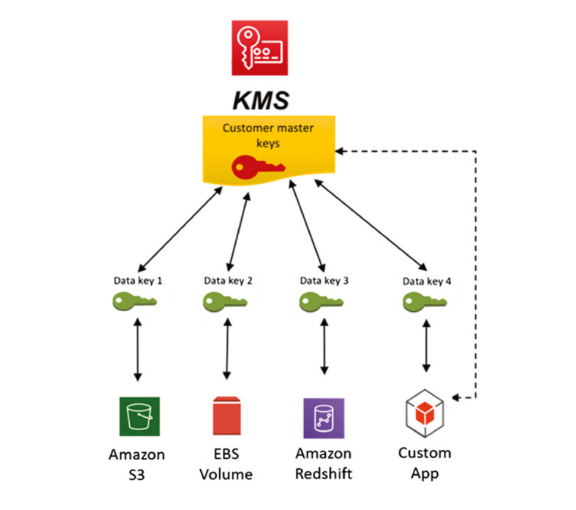

# Data Protection

Using a variety of AWS cloud security controls, services, and practices, a security team aims to create the mechanisms and implement the necessary controls to protect sensitive data stored in the AWS Cloud, thus meeting regulatory, security, and data privacy needs.

With the emergence of data privacy and protection regulations around the world (e.g. GDPR), data protection and privacy are becoming even more strategic topics for all kinds of business and governmental organisations.

## Encryption and Hashing

*Cryptography* is defined as the ability to transform standard text information into ciphertext using cryptographic algorithms and keys.

The use of encryption is essential to increasing the level of data protection, but encryption should be seen as a layer of defence and not the only defence.

When deploying encryption, you have two types of cryptographic algorithms you can implement, symmetric and asymmetric.

### Symmetric Encryption

Keys are strings of data that are used to encrypt and decrypt other data, specifically *symmetric encryption* algorithms, will use the same key for both operations.


The size of such keys determines how hard it is for an attacker to try all possible key combinations when attempting to decrypt an encrypted message.

AWS cryptographic tools and services support two widely used symmetric algorithms: 

- **Advanced Encryption Standard (AES)** with 128, 192, or 256-bit keys.
- **Triple DES (3DES)** which uses three 56-bit keys, working on a block of data and applying arbitrary round functions derived from an initial function.

### Asymmetric Encryption

*Asymmetric Encryption* uses two distinct keys (one public and one private) that are both mathematically derived. Asymmetric Encryption can be used to guarantee confidentially as well as authenticity (or non-repudiation).

AWS services typically support Rivest–Shamir–Adleman (RSA) for asymmetric cryptographic key algorithms. RSA uses key sizes of 1024, 2048, and 3072 bits.

#### How to Guarantee Confidentially

If Alice wants to send some data to Bob, Alice would need to encrypt the data using Bob's public key, and Bob would decrypt the data using his private key. 

Likewise, if Bob wanted to send data back to Alice, he would need to encrypt the data using Alice's public key, and Alice would decrypt using her private key.

*Note:* the private keys must be adequately protected against any improper access in order for this to be secure.

#### How to ensure Authenticity 

When private keys are used to digitally sign a message, it assures the receiver that only the owner of the private key could sign it correctly. 

The destination that receives the message can validate whether the message came from the expected source, using the public key.


### Hashing

Hashing is a feature that applies a *hashing algorithm* to a piece of information generating a message digest. Different input sizes generate different digest output, but the digest length will always be the same.

A good hashing algorithm is irreversible, hut as hashed values are smaller than the original data, duplicate hashed values can be generated, which are known as *collisions*.

Collisions can be avoided by using larger hash values, or they can be resolved with multiple hash functions, overflow tables, or salts.


## AWS Key Management Service

The *AWS Key Management Service (KMS)* allows you to natively encrypt data in a seamless and integrated manner with many AWS services, such as Amazon RDS, Amazon DynamoDB, Amazon Redshift, Amazon EMR, Amazon S3 and Amazon EBS. KMS supports an end-to-end encryption strategy, enabling the encryption of data stored on servers (EBS), objects stored on Amazon S3 and on various databases.


The diagram above highlights where the AWS KMS service can be used to encrypt data across the three most common application layers.

AWS KMS uses dedicated hardware security modules to generate keys, and will manage these instances for you. A dedicated HSM can be created, when regulatory and security policies require such a function via the Amazon CloudHSM deployment.


### AWS KMS Components

The AWS KMS service contains a number of components that allow for data to be easily encrypted and decrypted.

#### Master and Data Key

One of the biggest challenges when you are implementing symmetric key encryption models is the protection of the keys. While is it possible to encrypt a key with another key, you still have to find a way of storing the last key securely. The last key requires the highest level of protection and is commonly known as the *master key*.


Due to the nature of key protection, AWS KMS creates the environment to manage and protect your master keys. The AWS KMS service never exposes your master key in clear text, outside of the protected boundary. The master key is used to encrypt and protect your data key, and the data key is used to encrypt and decrypt your data in many different services.


Access to the master key can only be achieved via the AWS Console, CLI or SDKs, and thus new keys can be created in a secure manner (see diagram below). The master keys are protected by Federal Information Processing Standard (FIPS) 140-2 validated cryptographic modules.


#### Customer Master Keys

A customer master key (CMK) is a 256-bit AES for symmetric keys that has a unique key ID, alias, and ARN (Amazon Resource Name) and is created based on a user-initiated request through AWS KMS. 

A CMK resides at the top of your key hierarchy, and is not exportable - it can only reside within AWS KMS. A CMK can be used to integrate multiple data keys, to protect data in an integrated manner with other AWS services.



##### Attributes

Customer master keys have three additional attributes that can be used for identification:

- **KeyID** is a unique key identifier that does not change until the key is rotated
- **Alias** is a user-friendly name that can be associated with a CMK, that can be referenced by applications and services and will alway refer to that key, regardless of if the key has been rotated
- **ARN** the Amazon Resource Name for the key

##### Permissions

The *permissions* define the principals that are allowed to use the keys for encryption and decryption, and also the account(s) that can administer and add IAM policies to the key.

Each CMK must have at least two policies roles defined:

- **Key Administrators** IAM users or roles that can manage the keys
- **Key Users** IAM Users or roles that can use the keys to encrypt or decrypt data


*Note: the AWS Root account will be able to perform all actions upon a CMK, regardless of the policies that have been assigned to the CMK.*


### Managing Customer Master Keys

Within the AWS KMS service there are three categories of keys:

- **AWS managed keys** are the default master keys that protects S3 objects, Lambda functions and Workspaces when no other keys are defined for these services.
- **Customer-managed keys** are CMKs that the users can create an administer using JSON policies
- **Custom key stores** are used when you want to manage your CMKs using a dedicated AWS CloudHSM cluster, giving you direct control to the HSMs that generate and manage the key material for your CMKs

#### Creating Keys

Creating a new key can be completed via the AWS Console, CLI or SDK. 

You will need to provide the following details:

- **Key Type** either symmetric or asymmetric
- **Origin** should be one of KMS, External Key Store or CloudHSM Store
- **Regionality** either single-region or multi-region (with the latter replicating into multiple AWS Regions)
- **Alias** the alias of the key
- **Key Administrators** IAM users or roles that can manage the keys
- **Key Users** IAM Users or roles that can use the keys to encrypt or decrypt data
- **Key Deletion** whether to allow administrators of the key to delete it (if not selected, only the root user can delete the key)

#### Deleting Keys

When you delete a CMK you will not be able to decrypt data that was encrypted with that CMK any more - i.e. the encrypted data becomes unrecoverable.

AWS KMS enforces a minimum of 7 days and a maximum of 30 days (default configuration) as a waiting period for deleting a CMK. If you are in doubt, it is possible to disable the CMK and enable it again later if necessary.

When a CMK is set to pending deletion or disabled, the CMK cannot be used, nor rotated. Additionally AWS KMS does not rotate other derived keys from a pending deletion or disabled CMK.

When deleting a multi-region key, you will need to delete all the replica keys first, and then delete the primary key. If you want to delete the primary key, you should first promote a replicate to become primary, and then schedule the deletion of the old primary key.

#### Rotating Keys

You can use the AWS Console or CLI to enable and disable automatic key rotation, as well as view the rotation status of any CMK. When you enable automatic key rotation, AWS KMS automatically and transparently rotates the CMK every 365 days after the enable date.

When an S3 bucket is using KMS keys to protect data, KMS manages the entire rotation process, keeping the previous cryptographic material used to generated data encryption keys. After rotating a CMK, new objects will be encrypted using the new key, while older objects will be decrypted using the older keys. The new Key will retain the old CMK Id, and will contain the new key material.

Manual key rotation may be needed because of rotation schedule or if you have brought your own keys into KMS. When rotating manually, you will have a new CMK ID, so you will need to use aliases if you do not want to update your applications. You should also keep the old keep otherwise, you will not be able to decrypt the old data.

#### Multi-Region Keys

Keys can be replicated t different regions, and will have the same key maternal, and key id. However they will reside in different physical locations, and therefore will have a different ARN,

The main advantage is that it allows for data to be encrypted and decrypted in different regions using the same key material. Example usages cases include DynamoDB Global Tables, Active-Active setups or distributed signing applications.


### KMS Envelope Encryption

The KMS Encrypt API is limited to 4Kb, for larger data sets you need to use the Envelope Encryption API.

You need to use the GenerateDataKey API to generate a unique symmetric data key (DEK). The DEK that is returned from this call should be used to encrypt the data (or file) locally. 


To decrypt the data, you will need to send the encrypted data along with the encrypted DEK key (in an envelope) to KMS, which will return you a plaintext DEK file. The plaintext DEK file can then be used to decrypt the data locally.


#### Data Key Caching

It is possible to re-use the same data keys for multiple operations, which can help reduce the number of calls into KMS, and thus reduce costs. However the trade off is a reduction in security, as the same key is being used multiple times.


### KMS Key Policies

AWS provides a default key policy that allows all users access to a key (assuming the user has the appropriate IAM policy to use the key). It is possible to apply a custom policy if required.

AWS Managed key can be viewed, but no custom policies can be applied, where as CMKs can have customer policies applied.

Key policies can grant IAM users or roles to perform actions against it, as well as using the default policy + IAM permissions for the given user/role.

```json5
{
    "Id": "key-policy",
    "Version": "2012-10-17",
    "Statement": [
        {
            "Sid": "Enable IAM User Permissions",
            "Effect": "Allow",
            "Principal": {
                "AWS": "arn:aws:iam::111122223333:root"
            },
            "Action": "kms:*",
            "Resource": "*"
        },
        {
            "Sid": "Allow access for Key Administrators",
            "Effect": "Allow",
            "Principal": {
                "AWS": "arn:aws:iam::111122223333:role/AdminRole"
            },
            "Action": [
                "kms:*"
            ],
            "Resource": "*"
        },
        {
            "Sid": "Allow use of the key",
            "Effect": "Allow",
            "Principal": {
                "AWS": "arn:aws:iam::111122223333:role/UserRole"
            },
            "Action": [
                "kms:Encrypt",
                "kms:Decrypt",
                "kms:ReEncrypt*",
                "kms:GenerateDataKey*",
                "kms:DescribeKey"
            ],
            "Resource": "*"
        }
    ]
}
```

#### Key Policy Evaluation Process


### KMS Key Grants

A key Grant allows you to grant access to specific KMS keys for other IAM User or Roles in your AWS account as well as other AWS Accounts. It is often used to provide temporary access to a key (can only be used for one key only).

It allows the principal to perform any operation that is specified within the grant. Key Grants do not expire automatically, and must be delete manually.

KMS Grants cannot be created from within the Console, but can be created via the AWS CLI or AWS SDK.

One of the main advantages of Key grants is that KMS Key Policies or IAM Policies do not need to be changed.

KMS Key Grants are often used by a service, to grant access to a KMS for for a given operation, for example EBS will create a Key Grant to encrypt/decrypt data to/from an EBS volume, and will remove the key grant when complete.

### Protecting RDS with KMS

- You can only enable encryption for an Amazon RDS database instance when you create it, not after it is created. 
- You cannot have an encrypted read replica of an unencrypted database instance or an unencrypted read replica of an encrypted database instance. 
- You cannot restore a backup or unencrypted snapshot to an encrypted database instance. 
- Encrypted read replicas must be encrypted with the same key as the source database instance. 
- If you copy an encrypted snapshot within the same AWS region, you can encrypt the copy with the same KMS encryption key as the original snapshot, or you can specify a different KMS encryption key. 
- If you copy an encrypted snapshot between regions, you cannot use the same KMS encryption key for the copy used for the source snapshot because the KMS keys are region specific. Instead, you must specify a valid KMS key in the target AWS region.

### Protecting EBS with KMS

- Encryption by default is a region-specific setting. If you enable it for a region, you cannot disable it for individual snapshots or volumes in that region.
- By enabling encryption by default, you can run an Amazon EC2 instance only if the instance type supports EBS encryption.
- EBS volumes are encrypted by your account’s default client master key unless you specify a customer-managed CMK in EC2 settings or on execution
- Encryption by default does not affect existing EBS snapshots or volumes, but when copying encrypted snapshots or restoring unencrypted volumes, the resulting volumes or snapshots are encrypted
- Without encryption by default enabled, a restored volume of an unencrypted snapshot is unencrypted by default.
- When the CreateVolume action operates on an encrypted snapshot, you have the option of encrypting it again with a different CMK. 
- The ability to encrypt a snapshot while copying lets you apply a new CMK to an already encrypted snapshot belonging to you. Restored volumes from the resulting copy are only accessible using the new CMK
- You can't change keys used by an EBS volume, instead you have to create a snapshot, which will be encrypted with the original key, and create a new volume using the new key.
- Sharing EBS snapshots between accounts requires the snapshot to be decrypted first, then encrypted in the 2nd account
- EBS encryption can be enabled by default at the account level - this is disabled by default

#### Data Volume Wiping

If you delete an EBS volume, it is overwritten with 0's by AWS before it can be allocated to a new volume.

There is no need to manually wipe data - if an exam question asks this, then doing nothing is the correct answer!

### Protecting EFS with KMS

- You cannot encrypt an existing EFS, so you must create a new EFS that is encrypted.
- The files will need to be migrated to the new encrypted EFS using AWS DataSync
- Applications will need to to point to the new EFS instance when the data has been copied across

### Using ABAC with KMS

- You can control access to KMS keys based upon the tags and aliases values
- IAM policies should make use of the `aws:ResourceTag` condition

### Using Parameter Store with KMS

- SSM Parameter Store Secure String values are encrypted/decrypted using a KMS key.
- Standard values (supports for to 4KB) use the KMS Key directly; Advanced (supports up to 8kb of data) uses the envelop method
- SSM Parameter Store only support symmetric keys, and you need to have permissions to access both the KMS Key and the Parameter in SSM Parameter Store 

## Understanding the Cloud Hardware Security Module

A hardware security module (HSM) is a hardware-based encryption device. 

AWS CloudHSM is a managed service that automates administration tasks such as hardware provisioning, software patching, high availability configurations, and key backups. AWS CloudHSM lets you scale quickly by adding or removing on-demand HSM capabilities, in a pay-as-you-go model.

Generally, the use of an HSM Cloud is directly related to meeting regulatory needs, such as FIPS 140-2 Level 3 standards. To create an HSM cluster in the AWS Console, you must configure the VPC, subnets, and their availability zones where cluster members will be provisioned

Once you have created a cluster, you need to kickstart it by validating the HSM certificate chains, verifying the identity of your cluster, and then importing the signed cluster certificate and your issuing certificate. The diagram below illustrates the CloudHSM certificate hierarchy. Once setup, you can use CloudHSM to generate keys in a secure environment.


Each of the certificates are outlined below:

- **AWS Root Certificate:** This is AWS CloudHSM’s root certificate. 
- **Manufacturer Root Certificate:** This is the hardware manufacturer’s root certificate. 
- **AWS Hardware Certificate:** AWS CloudHSM created this certificate when the HSM hardware was added to the fleet. This certificate asserts that AWS CloudHSM owns the hardware. 
- **Manufacturer Hardware Certificate:** The HSM hardware manufacturer created this certificate when it manufactured the HSM hardware. This certificate asserts that the manufacturer created the hardware. 
- **HSM Certificate:** The HSM certificate is generated by the FIPS-validated hardware when you create the first HSM in the cluster. This certificate asserts that the HSM hardware created the HSM. 
- **Cluster CSR (certified signing request):** The first HSM creates the cluster CSR. When you sign the cluster CSR, you claim the cluster. Then, you can use the signed CSR to initialize the cluster.

Once the Cluster HSM (a collection of individual HSMs) is configured, the client can access the service through network interfaces and security group configurations directly from their VPC.

Each cluster is spread across multi-AZ, and provides a highly available service.

The CloudHSM Client is used to manage all the keys - if you loose the keys, AWS is unable to help or recover them.

Sharing CloudHSM across AWS accounts can only be achieved by sharing the private subnets that CloudHSM reside in (via AWS RAM) - it is not possible to share the CloudHSM cluster itself.


*Note: Applications in the Customer VPC must use an ENI to access CloudHMS and keys provisioned in the service VPC.*

### Using CloudHSM with AWS KMS

AWS CloudHSM can integrate with the AWS KMS service, allowing for the CloudHSM cluster to protect the customer master keys (CMKs) and thus the data keys and data in the most diverse AWS cloud services.

When you are using your own key store using AWS CloudHSMs that you control, KMS generates and stores the Key material for the CMK inside the CloudHSM cluster that you own and manage - i.e. the cryptographic operations under that Key are performed by your CloudHSM cluster.

The main scenarios in which you'd want to use your own CloudHSM are:

- You have keys that are required to be protected in a single-tenant HSM or in an HSM over which you have direct control
- You must store keys using an HSM validated at FIPS 140-2 Level 3 overall (the HSMs used in the default KMS key store are validated to Level 2).
- You have keys that are required to be auditable independently of KMS

CloudHSM can be used to generate hashes, where as KMS does not provide this functionality. 

### SSL Offload Using CloudHSM

You can use AWS CloudHSM to offload SSL encryption and decryption of traffic to your servers or instances, improving private key protection, reducing performance impact into your application, and raising your application security when using AWS Cloud.

Additionally, you can use CloudHSM to use along side the Microsoft Signing tool and the Java Signing tool.


## AWS Certificate Manager

AWS Certificate Manager (ACM) is a managed service that allows you to quickly provision, manage, and deploy Secure Sockets Layer (SSL)/Transport Layer Security (TLS) certificates for use with both AWS Cloud–native services and your internal resources.

The AWS Certificate Manager service allows for SSL certificates to be requested and deployed into ACM-integrated AWS services such as Elastic Load Balancers, Amazon CloudFront distributions, and Amazon API Gateway. Moreover, the AWS Certificate Manager will administer the renewals of these certificates

The service can also be used for internal digital certificate generation, functioning as an internal CA (certificate authority). 

ACM has no costs when used within the AWS-native environment and resources. However, when using it as an internal certificate authority for on-premises environments, it has a monthly cost/

ACM can automatically generate certificates for domains that you own, to which you will need to provide proof of ownership via email notification or via DNS Domain Validation. When generating private certificates, you do not need to verify you are the owner of the domain.

ACM will send notifications about renewals, 45 days before expiration. Renewed certificates will keep the same AWS ARN. Certificates that have been imported, will need to be updated manually - ACM will still send notifications 45 days before expiration.

AWS Config has a managed rule that can be enable to check for expiring certificates.


## Protecting S3 Buckets

Since any type of data can be stored in S3, it is crucial to apply the necessary security measures to protect sensitive information that may have been stored in S3.

### Default Access Control Protection

Every bucket in S3 is created by default as a private bucket - i.e. no public external access. 

Even so, when a bucket is created as private, its configuration can be changed by a user if they have predefined access to do so, which could mistakenly make the bucket public, due to an operational or automation process error

### Bucket and Object Encryption

When created with the default settings, buckets are automatically defined as private.  Additionally, Amazon S3 now applies server-side encryption with Amazon S3 managed keys (SSE-S3) as the base level of encryption for every bucket in Amazon S3 (only for buckets created after January 2023).

Amazon S3 supports the following encryption configurations:

- **SSE-S3:** Server-side encryption with Amazon S3–managed keys 
- **SSE-KMS:** Server-side encryption with KMS customer-managed master keys 
- **SSE-C:** Server-side encryption with customer-provided encryption keys
- **Client Side:** Client-side encryption that is performed by the customer before uploading to S3

#### SSE-S3 Encryption

SSE-S3 is the native encryption functionality of the AWS S3 service, and provides the required functionality to natively encrypt objects inserted into a bucket using an AES-256 symmetric key, which is automatically generated and managed directly by the S3 service, at no additional cost.

#### SSE-KMS Encryption

SSE-KMS is the encryption functionality of the S3 service that uses encryption keys managed with KMS. This functionality sets the behaviour of S3 to encrypt by default every object inserted into the specified bucket using keys managed through KMS, regardless of whether they are AWS managed keys or customer-managed keys. 

Objects inserted in the bucket after this configuration is performed will be encrypted even if no encryption option is specified in the request

One unnoticed advantage is that you can audit key usage when using SSE-KMS, as you can view the KMS requests vis CloudTrial

It is also important to know that an extra cost might incur in this configuration, as additional requests are being made to the AWS KMS service.

Objects encrypted using the SSE-KMS method can never be read by anonymous users, as these users would need access to KMS to decrypt the data - likewise uploading new files anonymously is not supported either.

##### Uploading Large files with KMS

When uploading a large file to S3, you must use a multipart upload. The requester must ask have permissions:

- `kms:GenerateKey` allows you to encrypt each object part with a unique data key
- `kms:Decrypt`- decrypt the object parts before the can be assembled in to large file, and then encrypt the entire file as one

AWS will stitch the file back together, and use these permissions to encrypt the file.

**Note: this is a typical exam question.**

#### SSE-C Encryption

Using SSE-C, you can set your own encryption keys, which you must provide as part of a request. Amazon S3 manages encryption and decryption when storing and accessing objects using the customer key provided.

The customer is in charge of managing the keys provided in each request, and only the data is encrypted and not the object’s metadata. When you upload an object, Amazon S3 uses the provided encryption key to apply AES256 encryption to the data and deletes the encryption key from memory, thus not storing the encryption key you provided.

When writing data into S3 using SSE-C, you must use the HTTPS endpoints - HTTP is not supported.

*Note: If the customer loses the encryption key, the stored object data is also lost.*

#### Client Side Encryption

Client-side encryption that is performed by the customer before uploading to S3. AWS provides the Amazon S3 Client Side Encryption Library to handle this logic (although the customer needs to provide their keys and use this library within the application).

### S3 Secure Transport

When writing data into S3 using SSE-C, you must use the HTTPS endpoints - HTTP is not supported.

To force the use of HTTPS, you can apply the `aws:SecureTransport: true` condition upon the bucket's policy,

To force encryption, via bucket policies, you can make use of the `s3:x-amz-server-side-encryption: aws:kms` on the pubObject action.

*Note:* Bucket Policies are evaluated before default encryption settings.*

### SSE-KMS Encrypted Objects Replication

By default, Amazon S3 doesn’t replicate objects that are stored using SSE-KMS. You must modify the bucket replication configuration to tell Amazon S3 to replicate these objects using the right KMS keys.

You must select the right CMK used to decrypt the objects in the source bucket, and then define the destination bucket with the destination key to encrypt the objects

### S3 Bucket Key

Amazon S3 Bucket Keys reduce the cost of Amazon S3 server-side encryption with AWS Key Management Service (AWS KMS) keys (SSE-KMS). Using a bucket-level key for SSE-KMS can reduce AWS KMS request costs by decreasing the request traffic from Amazon S3 to AWS KMS. 

When you configure your bucket to use an S3 Bucket Key for SSE-KMS, AWS generates a short-lived bucket-level key from AWS KMS then temporarily keeps it in S3. This bucket-level key will create data keys for new objects during its lifecycle. 

S3 Bucket Keys are used for a limited time period within Amazon S3, reducing the need for S3 to make requests to AWS KMS to complete encryption operations. This reduces traffic from S3 to AWS KMS, allowing you to access AWS KMS-encrypted objects in Amazon S3 at a fraction of the previous cost.


Bucket keys are enabled by default when using KMS or S3 provided keys.

*Note: when enabled you will see fewer events in CloudTrail.*

### S3 Object Lock

S3 Object Lock can help prevent Amazon S3 objects from being deleted or overwritten for a fixed amount of time or indefinitely. Object Lock uses a write-once-read-many (WORM) model to store objects

To utilise S3 object lock you must enabled versioning, as the lock policies are assigned on an object-level (rather than a bucket level).

Before applying an object lock, you will need to choose a retention mode:

- **Compliance:** Objects versions cannot be overwritten or deleted by any user including the root user. The retention modes for objects cannot not be changed, and retention periods cannot be shortened. This is the most strict retention mode.
- **Governance:**  Most users will not be able to overwrite or delete an object version, but some users have special permissions to change the retention or delete the object.

Object Lock provides two ways to manage object retention:

- **Retention period:** A retention period specifies a fixed period of time during which an object remains locked. You can set a default retention period on an S3 bucket. You can also set a unique retention period for individual objects. 
- **Legal hold:** A legal hold provides the same protection as a retention period, but it has no expiration date. Instead, a legal hold remains in place until you explicitly remove it. Legal holds are independent from retention periods and are placed on individual objects.

An object version can have a retention period, a legal hold, or both.

### Lifecycle Rules

To manage your objects so that they are stored cost effectively throughout their lifecycle, you can setup Amazon S3 Lifecycle Rules. Each rule allows you to define a set of actions that Amazon S3 applies to a group of objects. 

There are two types of actions:

- **Transition actions:** allow you to transition data between different storage classes, such as moving data to glacier after 6 months.

- **Expiration actions:** allow you to expire (delete) objects after a period of time, e.g. access log files to be removed after 1 year

To help you decided when to transition objects, you can utilise the S3 Analytics functionality, which produces a css file of objects and their recommended transition action. S3 Analytics only  make recommendations for Standard and Standard IA - One-Zone or Glacier is not supported.

### Replication

Replication enables automatic, asynchronous copying of objects across Amazon S3 buckets. Data copying is performed in an asynchronous manner, meaning that there may be a delay in replicating data.

In order to replicate objects, you must enable object versioning in both the source and destination buckets, this is because delete markers are replaced, but deletions are not replicated to avoid malicious deletes. Additionally the correct permissions to replicate objects from the source to the destination bucket must be assigned.

Only new objects are replicated after turning on replication - existing objects can be replicated using the S3 Batch replication job provided by Amazon S3.

There are two types replication strategies:

- **Cross-Region Replication:** is used to copy objects across Amazon S3 buckets in *different* AWS Regions, and can help you need compliance requirements, minimise latency and increase operational efficiency
- **Same-Region Replication:**  is used to copy objects across Amazon S3 buckets in the *same* AWS Regions, and can help you aggregate logs into a single bucket, replicate data between production and test accounts, adhere to data sovereignty laws such as storing multiple copies of your data within the same region

*Note: chaining of replication is not supported.*


### S3 Glacier

Amazon S3 Glacier is an online file storage web service that provides storage for data archiving and backup

#### Glacier Vault Access Policy

An Amazon S3 Glacier vault access policy is a resource-based policy that you can use to manage permissions to your vault.

You can create one vault access policy for each vault to manage permissions, and you can modify permissions in a vault access policy at any time.

#### Glacier Vault Lock Policy

S3 Glacier Vault Lock helps you to easily deploy and enforce compliance controls for individual S3 Glacier vaults with a Vault Lock policy. You can specify controls such as "write once read many" (WORM) in a Vault Lock policy and lock the policy from future edits.

You must create a Vault Lock policy, and then lock the policy. Once the policy has been locked, it can no longer be modified. The main advantage of using a Vault Lock policy is to ensure that archival data cannot be changed or deleted in the future, thus helps for compliance and data retention

An example of a vault lock policy might be to forbid deleting an archive if less than 1 year old.

The process for locking a vault is shown below.


#### Glacier Vault Policies

Each Glacier Vault has one vault access policy and one vault lock policy. Both policies are written in JSON.

Vault Access Policy is akin to a bucket policy, and is used to restrict access to the data.

Vault Lock Policy is a policy that you lock for regulatory and compliance requirements - once the policy has been locked, it can never change changed.


## AWS Backup

AWS Backup is a fully managed backup service that automates the backup of data across multiple AWS services, helping you achieve your disaster recovery and compliance requirements.

AWS Backup supports the following services (and more are being added):

- Amazon EC2, Amazon EBS, 
- Amazon S3, EFS/FSx, Storage Gateway
- RDS, Aurora, DocumentDB, DynamoDB

AWS Backup can be configured to store backups in different regions or different accounts. AWS Backup also supports point-in-time recovery do services that support this feature, such as DynamoDB.

You will need to create a backup plan that contains details such as:

- The frequency at which the back is to be ran, such as hourly, daily, monthly
- The window in which the backup will be executed
- When the data should be transitions to cold stage, in days, weeks, months, years, never
- The backups retention period, such as days, weeks, months, years, forever

Backup plans can be executed on-demand or on a schedule.

All data is backed up to an S3 bucket that is managed and owned by AWS.

### Backup Vault Lock

Creating a Vault Lock enforces a Write Once Read Many (WORM) state for all the backups that your store in your AWS Backup vault.

It provides an additional layer of defence to protect your backups against delete operations, as as protected against updates that shorten or alter retention periods.

*Note: the root user of the account cannot manually delete backups when enabled.*


## Amazon Data Lifecycle Manager

You can use Amazon Data Lifecycle Manager to automate the creation, retention, and deletion of EBS snapshots and EBS-backed AMIs.

Using this service, you can schedule backups and snapshots to be performed automatically as well as support cross-account backups.

The service uses resource tasks to identify the resources that will need to be backed up (for example environment=production).

This service cannot be used to backup instance-store AMIs or cannot be used to manage snapshots that few not created by Amazon Data Lifecycle manager.


## Amazon Macie

Amazon Macie is a security service that uses machine learning and artificial intelligence (ML/ AI) technology to discover, classify, and protect sensitive data in the AWS Cloud. 

Amazon Macie will search S3 buckets (only S3 Buckets) to create an inventory of sensitive data, personally identifiable information (PII), or intellectual property while providing dashboards and alerts that show suspicious access and unusual data-related activity.

A number of data identifiers can be used to detect different types of data, such as credit card information. Predefined identifiers or customer identifiers (via a RegExp) can be configured within Macie, as well as Allow/Ignore lists.

Additionally Amazon Macie will use CloudTrail Events to identify bad behaviours and to generate findings. Each finding is stored for 90 days, can be sent to Security Hub or EventBridge for further processing.


The diagram above shows the S3 data inventory classification, and in the top-right corner, the alerts classification per user category. Macie categorizes the alerts based on four different categories: platinum, gold, silver, and bronze.

- **Platinum:** IAM users or roles that have a history of making high-risk API calls indicative of an administrator or root user. These accounts should be monitored closely for signs of account compromise. 
- **Gold:** IAM users or roles that have a history of making infrastructure-related API calls indicative of a power user, such as running instances or writing data to Amazon S3. 
- **Silver:** IAM users or roles that have a history of issuing high numbers of medium-risk API calls, such as Describe* and List* operations, or read-only access requests to Amazon S3. 
- **Bronze:** IAM users or roles that typically execute lower numbers of Describe* and List* API calls in the AWS environment.

Macie supports AWS Organisations which allows for enabling sensitive data discovery across the entire organisation.

### AWS CloudTrail Events

Amazon Macie uses CloudTrail Events as a data source for monitoring and learning of possible anomalous behaviors in an AWS customer environment, assigning a risk level between 1 and 10 for each of CloudTrail’s supported events.

## AWS Nitro Enclaves

AWS Nitro Enclaves enables customers to create isolated compute environments to further protect and securely process highly sensitive data such as PII, healthcare and intellectual property data within their Amazon EC2 instances.

Nitro Enclave is a fully isolated Virtual Machine, that is hardened and highly constrained - there is no persistent storage, external networking or interactive access. Only signed code can be executed within a Nitro Enclave.

Common use cases include securing private keys, processing credit card, or secure multi-party computation.

To use an Enclave, you must set Enclave to `true` when launching an EC2 instance.
