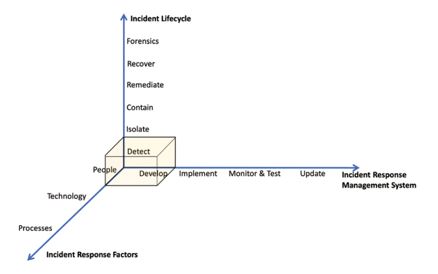

# Incident Response

*Incidents* are defined as a violation (or a threat of violation) of security policies, acceptable usage policies, or standard security practices. Incidents may be as harmful as a DDoS attack, or as mundane as an incorrect firewall configuration.

Incident responses can be *manual* or *automated*, for example you may receive a notification when a configuration has been altered and manually decide if it needs to be reverted. Alternatively, you could establish an AWS Config rule that receives the changed notification, compares it with the desired state, and takes immediate action to correct the misstep.

The set of actions - either *manual* or *automated* - are known as an *incident response plan*.

## Incident Response Maturity Model

Incident response is a comprehensive and wide-scoped topic that tries to provide a reduction to risks. The process may also involve external parties in addition to the internal organisation, such as law security research organisations, and forensics specialists.

The three components of an incident response plan are outlined below:

- **incident management** or how it can improve over time
- **constituent factors** such as people, technology, and processes
- **incident life cycle** detect, isolate, contain, remediate, recover, and forensics

An incident response plan is inherently a process, and it is subject to a continuous improvement cycle. It leverages the security wheel practical model (which was outlined in [Chapter 1](../chapter-01#the-security-wheel)) which comprises of the following actions: develop a security policy; implement security mechanisms; monitor and test the response to the incident; and manage and update the process accordingly.

In the maturity model presented above:

- **Within the develop phase** you will need to gather as much information about your protected resources as you can and define your goals, outcomes and any training that is required for the people involved. You should also assess any gap between the current and the desired levels.
- **Within the Implement Phase** you should carry out the actions and use tools to close the aforementioned gap. An important portion of this phase focuses on increasing incident visibility (such as using incident notifications) for the responsible personnel.
- **Within the monitor & test phase** you will put your security incident response plan into action either using a proactive or reactive approach. During the event, you should document and measure your capabilities to response.
- Within the update phase you will want to identify opportunities of improvement, and apply those improvements to your security response process

*Incident response actions* are performed by the constituent factors: people, technology, and processes.

- **People** refers to the human resources, both internal (such as IT information security departments, legal, compliance) and external to your organisation (such as authorities, security research organisations and forensics specialists) that are involved in an incident response.
- **Technology** refers to the technical tools to use in an incident response, examples within AWS Cloud are identity and access management, detective controls, and infrastructure and data protection.
- **Process** refers to a human-triggered or automated predefined sequence of actions to respond to a security incident. Automation can reduce the response times for suspicious activities to correct misconfigurations before any malicious actor can exploit them

The evolution of an incident is known as the *incident life cycle*. First you would *detect* the suspicious activity, and confirm what the impact is for the incident. Next you must *isolate* the affected resources, and *contain* the spreading to other resources. Corrective controls should be applied to *remediate* the affected resources, and once your environment has been recovered, your must confirm that it is performing as expected. 

Finally, you will execute a *forensics* analytical process to identify the root causes of the security incident and understand how it behaved along its whole life cycle. This outcome for this phase is critical for the continuous improvement cycle. 

## Incident Response Best Practices

A collection of best practices have been complied to help understand the features of each of the incident response best practices.

### Develop

- Identify the personnel required to deal with security incidents within the life cycle.
- Establish the gap between the current and desired state in incident response training.
- Conduct risk assessment that clearly identifies information classification and the factors that define the severity of an incident.
- Establish an inventory of your monitored resources using AWS Config and AWS Systems Manager capabilities.
- Implement a tagging strategy for your monitored resources to help with the incident response - e.g. tagging based on their their classification level, owners etc can allow for a faster identification of risk level at the time of the incident.
- Have a clear understanding of the different controls and countermeasures available in AWS Cloud.
- Establish a mechanism to stay up-to-date with the latest AWS services and features.

### Implement

- Implement detailed logging and monitoring across the whole infrastructure, and make use of detective controls.
- Make sure to include logging at the different levels of the workload, including services, resources, and applications, as well as centralising the logs and preparing the data structure for the analysis (e.g. pushing AWS CloudTrail Logs into an S3 bucket, so that Amazon Athena cab query them).
- Establish relevant metrics from the reported logs and plot them using Amazon CloudWatch metrics. For every metric, define thresholds and alarms.
- Configure notifications to be delivered through the right channels, providing relevant information and reaching the appropriate subscribers.
- Create AWS CloudFormation templates for your AWS Cloud environment that define and implement the guardrails and technical specifications for detection of security events.
- Consider automation to take snapshots of the involved systems (including storage systems and volatile information like memory content). Establish and test backup and restore procedures.
- For forensics analysis, use an isolated environment where you can deploy the infrastructure with the tools required for investigation.
- Put your incident response plan in writing, documenting the processes to analyse findings, query logs, and metrics and respond to incidents following the life cycle of the security incidents (from detection to forensics).
- Implement a training and awareness program for personnel to know and successfully execute the documented incident response processes. Topics such as how to query and analyse logs and findings, and how to react when an alarm is raised should be covered.
- Automate, as much as possible, the responses to security events.

### Monitor and Test

- Arrange to carry out the incident response plan in a controlled environment - i.e try to be proactive, rather than reactive.
- Prepare and execute security incident response simulations (SIRS), also known as incident response game days. These simulations should be as realistic as possible, but without affecting production environments.
- Executing your incident response plan in a real situation is also part of the check phase.
- Every action within the life cycle of the incident should be documented, which includes having an activity log for both the manual and automated processes, as well as collecting metrics during the process.

### Update

After an incident response plan has been effectively executed, given a thoughtful monitoring of the process, you will probably uncover some gaps. As part of the update phase, you should do the following:

- Document a root cause analysis (RCA) after every execution of the incident response plan. The RCA is a document in which you identify the reason behind the incident and describe the actions to avoid in the future, as well as any improvements to the plan.
- In addition to technical improvements, consider the people and processes dimensions. Human-related actions deviated from the documented processes can be improved by executing training and awareness activities.
- Review and update procedures that failed to solve the incidents at every stage of the life cycle in a timely manner.

## Reacting to Specific Security Incidents

### Abuse Notifications

If your account gets compromised and a bad actor uses it to attack other accounts or third parties, AWS may suspend your account to prevent attacks from spreading through the Internet.

For this reason, it is particularly important that you protect your workloads in the AWS Cloud. Additionally, you should detect and contain compromised instances while also keeping your security, billing and operations contacts updated in the account information.

It is also a best practice to define a dedicated alias - such as `aws-notifications@example.com` - that will deliver notifications to a team of security analysts, allowing for alerts to be acted upon.

AWS may use that contact information to inform you about suspicious activity that could affect the operation of your account, such as detected leaked access keys from your account or if one of your Amazon EC2 instances is attacking someone else.

### Insider Threat and Former Employee Access

When a user with privileged access leaves the company, you should remove all of the user’s access according to your security policies.

For example, you should delete the AWS IAM user completely or revoke AWS IAM access keys while disabling their AWS Console password.

If any security group with IP validation allowed access from the user’s home IP address, you should remove that access as well.

### Amazon EC2 Instance Compromised by Malware

When an EC2 instance has been compromised by Malware, you should consider performing the following best practices in your response plan:

- Take a snapshot of the EBS Volume at the time of the incident to allow the forensics team to work on the root cause of the compromise prior to shutting down the instance
- Isolate the instance as early as possible by, changing its security group to block all inbound/outbound traffic, detach any IAM role attached to the instance and removing the instance from an Auto Scaling groups so that a fresh instances is created from the template (this is also reduces service interruptions).
- Tag the instance as Compromised together with an AWS IAM policy that explicitly restricts all operations related to the instance to the incident response and forensics teams. Tags can be applied automatically by using AWS CloudWatch Events upon detection of specific Amazon GuardDuty finding types.
- Analysing the effected instance, should be done so in an isolated environment (ideally a private subnet within it's own VPC) - the instance can be restored using the EBS volume backup
- Analyze the logs and findings, such as operating system logs, application logs, AWS CloudTrail, Amazon VPC flow logs, or Amazon GuardDuty findings on that instance - Amazon Detective may be able to assist in the root cause.

### Credentials Leaked

The AWS Security team look for credentials being exposed, and can notify you by sending an email to your configured security contact. However, it is possible that a malicious actor finds your credentials first, and thus can easily generate an incident.

As a best practice, if any access key is leaked to a shared repository (like GitHub) - even if only for a couple of seconds - you should assume that the access key was compromised and revoke it immediately.

Additionally, accounts that have Business or Enterprise support can use the AWS Trusted Advisor Exposed Access Keys check to monitor popular code repositories and learn whether your access keys have been exposed to the public.

### Application Attacks

AWS WAF can effectively address attacks and vulnerabilities, and it's possible that creating custom rules can help in providing a virtual patch to the vulnerability until the development team fix the issue in their code.

If the type of attack you are receiving is a DDoS attack, the use of AWS Shield Advanced will protect you from Layer 7 attacks. Additionally, you will receive additional help from the AWS DDoS Response Team (DRT), as well as a refund of charges related to your infrastructure growth due to the DDoS attack

