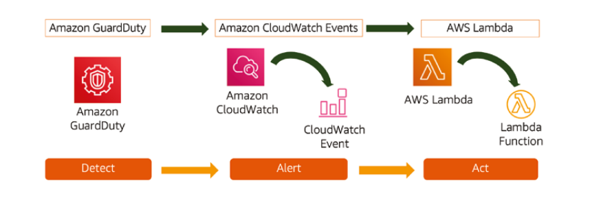
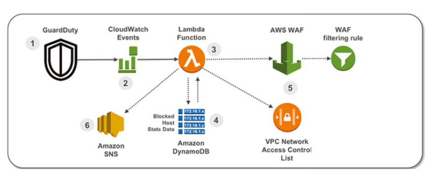
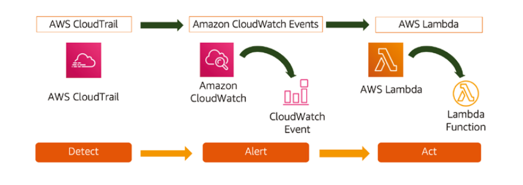
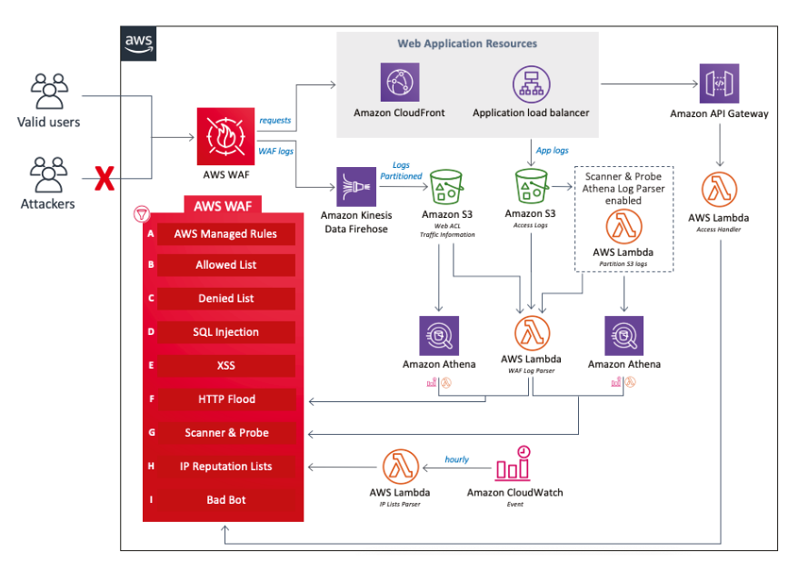
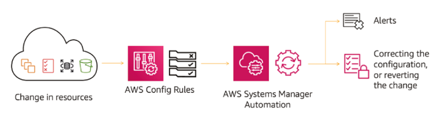
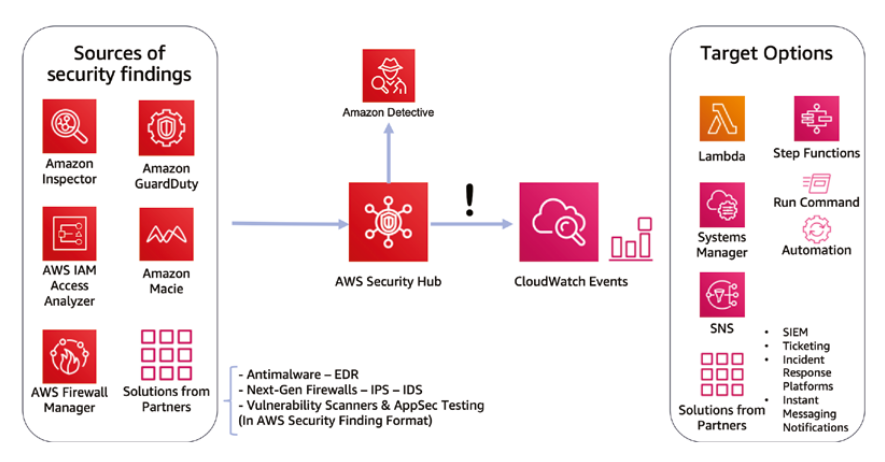

# Security Automation

As threats are always evolving in terms of complexity and volume, many organisations find it challenging to rely on a large team of specialists looking at dashboards to manage the emerging threats.

Security Automation's goal is to help to take some of the load away from security engineers, so that more complex challenges can be focused upon.

Automation can:

- Swiftly improve the consistency of security controls;
- Revert undesirable configuration drifts;
- Correct insecure configurations configurations that are usually caused by human error;
- Increase the speed of containment in the security incident response process

The actions performed in an automatic response to a security event, will reduce the risk exposure by minimising the window in which malicious actors can perform their activities.

## Event-Driven Security

When analysing existing incident response playbooks, a logical sequence of events often appears:

1. A detective control receives data from one or more data sources. Common data sources include:
   - **Logs:** AWS CloudTrail, DNS records, VPC flow logs, web application firewall logs, operating systems logs, application logs or AWS CloudWatch logs.
   - **Infrastructure:** Configurations or inventory
   - **Data:** Amazon S3 buckets data analytics

2. Using rules or machine intelligence, the detective control recognises an undesired condition and triggers an event, such as a Amazon CloudWatch Event, a finding in AWS Security Hub, or a ticket in the Incident Response Platform tool. Examples of detective capabilities include:
   - Amazon GuardDuty
   - AWS Config
   - Amazon Inspector
   - Amazon Macie
   - AWS IAM Access Analyzer

   Additionally, the following finds and events are frequently used to trigger an automated response:

   - Unsafe configurations (from AWS Config or Amazon Inspector) such as open buckets RDP/SSH open to all IPs etc
   - AWS Security Hub findings from 3rd Parties, such as antivirus software
   - Potential security indigents such as connections to anonymisation networks, e.g. TOR
   - Anomalies in the usage of Amazon EC2 resources, such as crypto-mining malware (which aims to max out CPU and GPU usage)
   - Any event from Amazon CloudWatch Events can trigger a response task

3. A response task is triggered that contains the threat in which the security team are alerted and/or resolves the configuration drift automatically. Common response tasks include:

   - An AWS Lambda function can use AWS APIs to change security groups or network ACLs
   - Systems Manager Automation documents can be used to correct configuration drifts detected by AWS Config
   - OS level actions can be performed by Systems manager Run Commands against multiple hosts at scale (e.g. patching an operating system)
   - Responses that require coordination between automated and human responses can make use of AWS Step Functions to follow a workflow of actions.

Amazon S3 supports event-driven security processes via executing an AWS Lambda function when changes to files, metadata or other events within an S3 bucket. For example, log files can be parsed by S3 as they arrive to detect potential security issues or to add a malicious actor to a black list.

Another example is that at the creation of a new file (PUT operation), we can trigger an AWS Lambda function that analyses the file looking for malware or sends the file to a malware sandboxing system for analysis.

##  Using AWS Lambda for Automated Security Response

AWS Lambda is an appropriate technology for implementing for event-driven security for the following reasons:

- It can execute custom code, including calls to AWS APIs
- It does not generate costs while it is not invoked
- It does not have the need for infrastructure management, which reduces the amount of human operators needed to maintain such a system.

Some of the more common ways of using AWS Lambda for automating security responses are outlined in the sections below.

### Isolating Instances with Malware on Botnets

Most organisations do not have a business reason for allowing anonymous access to remote resources from Amazon EC2 Instances, and therefore detecting activity from a TOR Client on an instance is probably malicious.

Malware will often use the TOR network to anonymously react out to an external resource to obtain remote command-and-control commands, as well as to ex-filtrate information from the host (such as credentials).

Amazon Guard Duty is able to detect TOR Client related activity via producing a finding that an instance is communicating with an IP address that is any entry node for the TOR network. Assuming an Amazon CloudWatch Event rule that looks for the `UnauthorizedAccess:EC2/TorClient ` event has been configured, it is possible for a Lambda function to be executed after such a finding has been reported.

The Lambda function can then be developed so that it is able to contain the threat, by assigning a security group to the infected host node that restricts all outbound network connectivity.

Once the thread has been neutralised, a security team can review the instance, to understand how the malware was able to gain access to the instance.

### Automated Termination for Self-Healing Using Auto Scaling Groups

When working within AWS auto scaling groups of instances that <u>do not have any state</u> (i.e. all data is stored externally in databases or Amazon S3 buckets), you can terminate an instance as part of an automated action, since a new one will be created by the auto scaling group.

Note: once the instance has been terminated, data cannot be retried by a security team, for root cause analysis - it is vital to perform a snapshot of the Amazon EBS volume before an instance can be terminated.

### Automating Isolation of Bad Actors’ Access to Web Applications

Amazon GuardDuty can detect potential bad actors, and you can block the attacker’s access to your applications by blacklisting their IP addresses on AWS WAF and adding network access control lists (NACLs) that deny access from the compromised instance.

For example, Amazon GuardDuty triggers Amazon CloudWatch Events, which in turn would execute a AWS Lambda function that blocks access to an application by updating the AWS WAF and NACLs. The list of blocked hosts would be updated by the Lambda function and stored in a DynamoDB table. 

An SNS notification can be fired once the process has completed, to update the security team that a potential attack has been stopped.

### Automating Actions upon Changes Detected by AWS CloudTrail

AWS CloudTrail can detect changes to an AWS resource, and then trigger an Amazon CloudWatch events rule that executes an AWS Lambda function to automate security objectives.

An example use of this may be to enforce encryption or versioning on a newly created S3 bucket, or to detect changes to security groups, that may trigger a remediation action (for example removing port 22 from a security group rule)

## WAF Security Automations

Web applications are a common point of entrance for attackers because they are frequently exposed to the public. AWS WAF offers AWS managed rules and allows customers to prevent such attacks taking place against their public applications.

AWS WAF logs and application logs are stored on Amazon S3 and then analysed to detect additional threats, such as malicious bots, including scrapers and spammers.

*Note: Not all vulnerabilities should be blocked by the WAF. Many need to be blocked in the applications, adding input validation and other controls. Blocking excessively on WAF can lead to false positives.*

## AWS Config Auto Remediation

One of the common challenges of securing workloads in the cloud is to maintain consistency of certain configurations that apply to all your accounts or resources, such as ensuring S3 buckets are encrypted.

AWS Config allows for these challenges to be overcome this challenge by performing various security-related tasks, such as:

- Maintaining an inventory of resources
- Comparing the infrastructure and configuration changes from one day to another
- Detecting compliance with a set of configuration rules, (via managed rules with common use cases or custom rules)
- Remediating configuration drifts by executing Systems Manager automations

AWS Config listens for resource change events, which are processed against it's list of enabled rules. If a non-compliance status is introduced, it can be automatically corrected using AWS Systems Manager Automation (as shown below).

Some of the common security use cases covered by AWS Config managed rules, are listed below.

| Use Case                                                     | Example remediation action                                   |
| ------------------------------------------------------------ | ------------------------------------------------------------ |
| Detecting access keys that were not rotated in the past X days/months | Notify or disable or remove access                           |
| Detecting the use of unapproved AMIs                         | Stop or terminate non-compliant instances                    |
| Detecting attached Amazon EBS volumes without encryption     | Notify or stop Amazon EC2 instances, detach volume and encrypt volume (custom) |
| Ensuring Amazon GuardDuty and AWS CloudTrail are enabled     | Enable Amazon GuardDuty and AWS CloudTrail                   |
| Running AWS IAM checks, such as detecting IAM policies attached directly to IAM users instead of using roles/groups, MFA, password policies, and unused credentials | Notify or disable non-compliant users                        |
| Running security groups checks, such as detecting the use of unrestricted access to common ports like RDP, SSH, or databases ports | Disable public access for security groups                    |
| Running Amazon S3 checks, such as whether public access is allowed or whether any buckets have default encryption set | Disable Amazon S3 public access;  Enable default encryption |

*Note: Some exam questions ask you for the simplest way to accomplish a task and offer one option that can do what is requested but in a complex way, and another option that uses an AWS Config managed rule that accomplishes the same goal but takes only minutes to set up (and costs much less).*

### Amazon S3 Default Encryption with AWS Config

AWS Services that support server-side encryption should always be enabled, as it's simple to implement, with low overheads and costs. 

Ensuring that such measures are enabled, can be completed using  AWS Config, which will automatically apply remediation to any resources that have not got server-side encryption enabled.  

### Exam Tip

On the exam, you will be given several valid options to achieve the required end result, but one option would imply configuring several components or using custom code that is hard to build and maintain. 

If one of the options is a native feature that can achieve the same result in a simpler way, this option will be the right one. For example, one option might be to use a native AWS Config rule to detect and correct a configuration drift such as unapproved
AMIs in use. Another option might be to use Amazon CloudWatch events to detect the launch of a new instance and then use an AWS Lambda function to query a list in DynamoDB with the approved AMIs to decide whether the ­instance should be terminated.

## Automating Resolution of Findings Using AWS Security Hub

AWS Security Hub can help a lot with security automation. Because many different types of issues generate findings on AWS Security Hub, this service is the perfect place to centralise the remediation of such potential vulnerabilities in semi-automatic or automatic mode.

Within the AWS Security Hub, you can take one of the following three approaches to resolve a security finding:

- **Manual:** You can correct a finding manually, or archive it if you recognise it as a false positive
- **Semi-Automatic:** Once you have analysed a finding, you can decide that a remediation action should be launched by selecting the finding and selecting the desired action from the drop-down menu (i.e. manual analysis, but an automated fix)
- **Automatic:** All findings from AWS Security Hub generate Amazon CloudWatch Events, so a completely automated response can be triggered immediately.

Using an AWS Lambda function as a target, an SSM Automation document, an SSM Run command, or an AWS Step Functions state machine can be used to automate a response. Such an approach is useful for containing threats such as worms that spread rapidly, or for known repeating issues that always require the same response

### Automated Reasoning to Detect and Correct Human Mistakes

AWS IAM Access Analyzer utilises automated reasoning to analyse resource-based policies (such as bucket policies, key
policies, and VPC endpoint policies) to detect when a resource is exposed outside of your AWS accounts and produce findings in AWS Security Hub.

AWS IAM Access Analyzer helps with the task of finding human errors that expose data to the public. It is also useful in unsecure situations such as when a developer sandbox account has access to a production resource.

## Aggregate and Resolve Issues with AWS Systems Manager

### AWS Systems Manager: OpsCenter

### AWS Systems Manager: State Manager

### Automating Security Hygiene with AWSmSystems Manager

