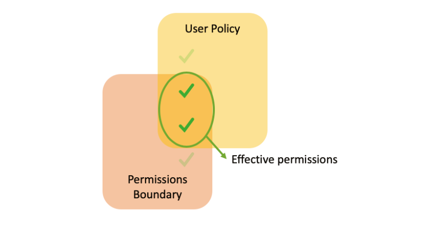
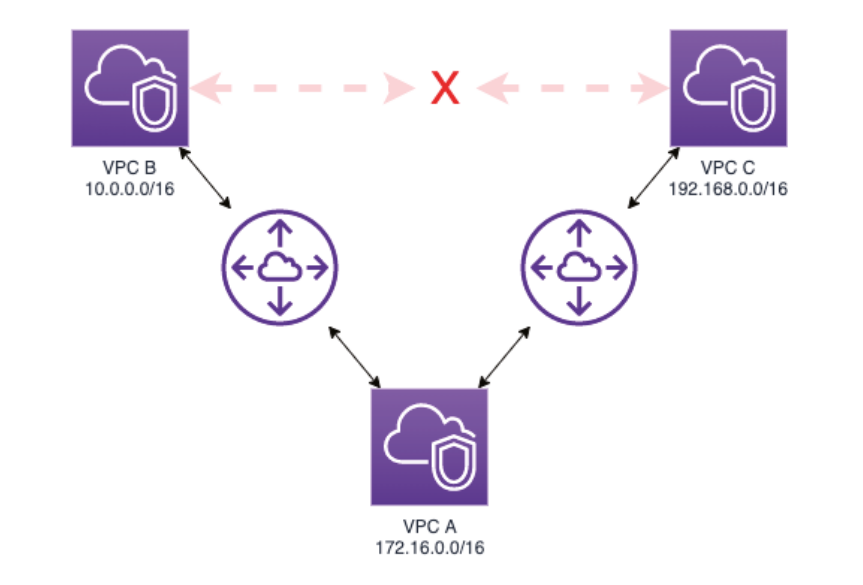

# Security Troubleshooting on AWS

Failures can occur at any time, and by using best practices and frameworks such as the Well-Architected Framework, the impact of impact of failures can be greatly reduced within AWS Cloud environments.

There are a number of abnormal behaviour scenarios that are caused by common configurations and integration mishandling which you should be familiar with.

## Using Troubleshooting Tools and Resources

### AWS CloudTrail

CloudTrail is a service that allows you to view the activities performed on your AWS Account. The service is able to provide a history of all the actions that are performed against your AWS account, as well as data events that flow between services.

CloudTrail is activated by default, but your will need to create a trail in order to obtain a continuous record of events. A Trail is able to write events into an AWS bucket, which allows for further processing of events.

When writing logs into an S3 bucket, the trail will need to be provided the required permissions in order to write into the bucket.

### Amazon CloudWatch Logs

Amazon CloudWatch Logs can be used to monitor, store, and access log files from various sources including, EC2 ,instances, AWS CloudTrail and Route 53.

To view EC2 logs within CloudWatch Logs, you must install an agent on the instance, and provide the instance the required permissions to write logs into an AWS CloudWatch Log Group. You must also ensure that the `awslogs` agent is running on the instance at all times.

### Amazon CloudWatch Event

Amazon CloudWatch Events delivers a near real-time stream of system events that describe changes in AWS resources. Using simple rules, you can match events and route them to one or more target functions or streams.

A rule can be configured to execute your own functions (that may apply corrective actions to resources) once an event is received. Additionally a rule can be executed as a `cron` or `rate` expressions.

### Amazon EventBridge

Amazon EventBridge is a serverless event bus that facilitates application interconnection using data from the applications themselves, applications integrated into the software as a service model, and AWS services.

EventBridge and CloudWatch Events use the same underlying APIs.

## Common Access Control Troubleshooting Scenarios

By default, access permissions on AWS are denied, meaning that you must be explicit about which permissions users and groups must have. 

When you are working with multiple policies, actions will only be allowed if no policies have explicit denial and at least one policy provides explicit access. That is, an explicit denial overrides permission.

### Permissions Boundary

A *permissions boundary* is a limit of permissions used to define the maximum permissions that a policy can grant to an IAM entity.

An entity’s permission limit allows the entity to per-form only the actions permitted by both identity-based policies and their permission limits. When you use a policy to set the permissions boundary for the user, it limits the user’s permissions but does **not provide grants on its own**.

### Service Control Policies

Service control policies (SCPs) are a type of organization policy that you can use to manage permissions in your organization. 

SCPs offer central control over the maximum available permissions for all accounts in your organisation, and they are available only in an organisation that has all features enabled.

Like Permission Boundaries, SCPs limit a user’s permissions but does **not provide grants on its own**.

### Identity Federation Problems

In AWS, there are three APIs that can be used with federated entities in the Security Token Service (STS): 

- `STS:AssumeRole` is used when you need to assume a specific role after authenticating with
  your AWS account.
- `STS:AssumeRoleWithWebIdentity` is used in cases of federation with OpenID Connect (OIDC) providers such as Amazon Cognito, Login with Amazon, Facebook, Google, or any OIDC-compatible identity provider
- `STS:AssumeRoleWithSAML` is used to assume a role when authenticated by a Security Assertion Markup Language (SAML)-compliant service

Additionally, a session policy can change the effective permissions of a role. A session policy is an inline policy that you can create on the fly and pass in the session during role assumption to further scope the permissions of the role session. Therefore the effective permissions of the session are the intersection of the role’s identity-based policies and the session policy.

## Encryption and Decryption Troubleshooting Scenarios

The AWS Key Management Service (AWS KMS) is a managed service that facilitates the creation and control of the encryption keys used to encrypt your data. 

The customer master keys that you create in AWS KMS are protected by hardware security modules (HSMs).

AWS KMS is integrated with most AWS services, and is also integrated with AWS CloudTrail to provide logs of encryption key use to help meet your audit, regulatory, and compliance requirements.

Some of the most common problems with using CMK keys include:

- The key policy must allow access to the key through an external account (trusted account) when using cross-account access.
- The external account must have an IAM policy allowing API calls to be made for the desired resource.

## Network and Connectivity Troubleshooting Scenarios

One of the biggest challenges for professionals who operate distributed systems is the identification of network-related problems.

The Amazon Virtual Private Cloud (VPC) allows the provisioning of a logically isolated network portion on AWS, which allows for complete control over virtual networks. VPC supports up to five IP address ranges, one primary and four secondaries for IPv4.

### VPC Security and Filtering

Two components can be used to filter traffic within the VPC - security groups, and network ACLs (NACLs).

Security groups are a stateful firewall that are used to specify the allowed inbound and outbound network traffic to and from
each Amazon EC2 instance. Traffic that is not explicitly permitted for an instance is automatically dropped - i.e. traffic is blacked by default.

NACLs perform stateless filtering and operate at the subnet level by evaluate traffic coming in and out of a subnet. NACLs do not filter traffic between instances on the same subnet.

### Route Tables

A route table contains a set of rules, which are used to determine where network traffic is directed. Every subnet in the VPC must be associated with a route table, and each subnet can be associated with only a single route table a ta time.

When troubleshooting routing tables, you must remember the following:

- Your VPC already has implicit routing and comes with a standard route table that can
  be modified.
- It is possible to create more route tables for your VPC.
- It is not possible to delete the main route table. However, you can customise the routes in it; the VPC main route table will be automatically associated with newly created subnets.
- When traffic matches more than one entry on the route table, the most specific
  will be used

#### Routing Priority

To determine how traffic should be routed, a route table priorities the most specific route in it. The routes for IPv4 and IPv6 addresses or CIDR blocks are independent of each other.

### Network Gateways

AWS has several types of network gateways available for use: the NAT gateway, the Internet gateway, and the Transit gateway.

NAT gateways are used in network address translation (NAT) to allow instances on a private subnet to connect to the Internet or other AWS services and to prevent the Internet from initiating a connection to those instances.

An Internet gateway (see Figure 9.3) is a redundant and highly available component of the VPC that allows communication between the instances in the VPC and the Internet. To enable internet communication, your instance must have a public IP address or an EIP associated.

The AWS Transit gateway (TGW) connects VPCs and their local area networks through a central hub, such as a cloud router. Traffic between an Amazon VPC and the AWS Transit gateway remains on the AWS global private network.

### VPC Peering

VPC Peering is a network connection between two VPCs that allows you to direct traffic between them using private IPv4 or IPv6 addresses - i.e. different VPCs can communicate with each other as if they were on the same network.

You can create a peering connection between your VPCs or with a VPC from another AWS account or AWS Region.

VPC can have more than one peering configured; it is essential to note that there is no transitivity using an intermediate VPC (see image below)

#### Troubleshooting Peering

Keep these factors in mind when troubleshooting peering connectivity:

- Check that the route is configured correctly on both VPCs.
- Check that the security group of the source and destination instances allow the necessary traffic.
- Check if there are any NACLs blocking requests. It is important to remember that network ACLs are stateless—that is, it is necessary to configure the rules for allowing IPs and ports in a bi-directional way (inbound and outbound), as explained at the beginning of this chapter.
- Use VPC Flow Logs to view accepted and rejected traffic in communication.

### VPC Flow Logs

VPC Flow Logs is a feature that makes it possible to capture information about IP traffic on VPC network interfaces.

Flow log data can be published to Amazon CloudWatch Logs and Amazon S3.

