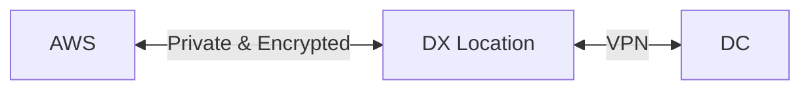
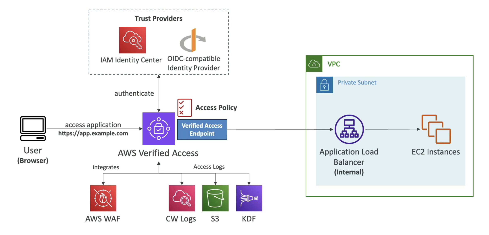

# Miscellaneous Services

## AWS Config

Some common use case for using AWS Config include:

- Audit IAM polices to ensure permissions are not too wide
- Detect if CloudTrail has been disabled
- Detect if EC2 instances are create using unapproved AMIS
- Detect if EBS volumes are encrypted
- Detect if Security Groups are open to the public (e.g. publish ssh access)
- Detect if RDS DBs are public

## AWS Trusted Advisor

Trusted Advisor inspects your AWS environment, and then makes recommendations when opportunities exist to save money, improve system availability and performance, or help close security gaps.

If you have a Basic or Developer Support plan, you can use the Trusted Advisor console to access all checks in the Service Limits category and six checks in the Security category.

If you have a Business, Enterprise On-Ramp, or Enterprise Support plan, you can use the Trusted Advisor console and the AWS Trusted Advisor API to access all Trusted Advisor checks

## AWS Cost Explorer

AWS Cost Explorer is a tool that enables you to view and analyse your costs and usage. You can explore your usage and costs using several pre-defined graphs.

You can also create reports that analyse cost and usage data for individual accounts and multiple accounts, as well as at a resource level.

Estimated costs are also provided, based upon previous usage.

### AWS Cost Anomaly Detection

AWS Cost Anomaly Detection is an AWS Cost Management feature, that uses machine learning models to detect and alert on anomalous spend patterns in your deployed AWS services.

The service is able to monitor resources that have been previously tagged, and send an anomaly detection report, with root cause analysis.

Notifications can be send via SNS on a daily or weekly basis.

## AWS Well-Architected Tool

AWS Well-Architected Too is a tool that provides a consistent process for measuring your architecture using AWS best practices. You will need to answer a series of questions and review the responses to help improve the architecture of the application.

### AWS Well-Architected Framework

AWS Well-Architected helps cloud architects build secure, high-performing, resilient, and efficient infrastructure for a variety of applications and workloads. 

The Well-Architected framework is built around six pillars:

- Cost Optimisation
- Performance Efficiency
- Reliability
- Security
- Operational Excellence
- Sustainability

## AWS Audit Manager

Audit Manager helps you continuously audit your AWS usage to simplify how you assess risk and compliance with regulations and industry standards

Audit Manager continuously audits AWS services against frameworks such as GDPR, and will generate reports of compliance with evidence folders.

Audit Manager integrates with Security Hub, AWS Config, Control Tower, CloudTrail and License Manager, and can be run across multiple account using AWS Organisations.

## AWS Service Catalog

Service Catalog enables organisations to create and manage catalogs of IT services that are approved for AWS. These IT services can include everything from virtual machine images, servers, software, databases, and more to complete multi-tier application architectures.

AWS Service Catalog allows for solutions to be installed within AWS accounts that follow organisation guileless and best practices, such as naming conventions, tag policies etc.

An administrator will create a product which are CloudFormation templates that are stored in a catalog. Users can view each product within the catalogue, and launch them accordingly.

## AWS Resource Access Manager (RAM)

AWS Resource Access Manager (RAM) provides customers a simple way to share their resources across AWS accounts or within their AWS Organisation.

You are able to share VPC Subnets, which allows for resources to be deployed from different accounts into the same subnet. Additionally you can share Transit Gateway, Route 53 Resolve Rules and License Manager, although these will not appear on the exam.

Each account is responsible for it own resources, and is not able to view view or modify other account resources within the same VPC Subnet.

The only sharing that occurs is at the network level, i.e. they can talk to each other using their own Private IPs.

Security Groups can be referenced between accounts if needed, but security groups cannot be shared between accounts.

You are unable to shared the default VPC.

**Exam Tip:** If you are presented with a question about sharing VPC subnets, the answer will involve AWS RAM. 

## Direct Connect

The AWS Direct Connect service offers private, low-latency connectivity to your AWS resources. It allows you to connect one or more VPCs in multiple regions to a Direct Connect location (DX is essentially a global router).

Direct Connect bypasses the Internet altogether, by giving you a dedicated route when accessing AWS resources, which can help by reducing the high latency of a broadband connection. It may also be desirable if you are required to meet regulatory requirements that preclude transferring data over the internet.

There are two types of Direct Connect connections:

- **Dedicated** is a single physical connection that terminates at an AWS Direct Connect location that requires your own equipment a Direct Connect location
- **Hosted** is a shared connection, that extends the "last-mile" connection from a Direct Connect location to your data centre or office

Lead times to configure a Direct Connect connection usually take longer than one month.

All data transmitted over Direct Connect is private, but not encrypted, which if required can be configured with DX+VPN which provides an IP-sec-encrypted private connection.

### Direct Connect Resiliency

Direct Connect High Resiliency refers to multiple DC location between the DC and AWS, and it good for critical workloads.

Direct Connect MaximumResiliency is for highly critical workloads and has multiple connections per Direct Connect  location and has multiple DX locations to provide maximum resiliency.

### Direct Connect & Site-to-Site VPN

If Direct Connect fails you can setup a backup connection using another Direct Connect link which can be expensive.

Alternately you can use a site-to-site VPN connection, which will route traffic over the internet (but it's encrypted).

## Elastic Container Registry

The AWS Elastic Container Registry (ECR) is used to store and manage Docker images. Access to each repository is via IAM policies.

ECR supports image vulnerability scanning, versioning of images and image lifecycle hooks.

ECR images can be encrypted at rest using AWS KMS, but this can only be enabled when creating the repository. When enabling KMS encryption, the user will need to have the CreateGrant kms permission.

ECR Image scanning finds vulnerable in your canner images, and supports two scanning types

- **Basic Scanning** use an open source database and is run on pushing of triage (or manual), and can be configured within the repository.
- **Advanced Scanning** uses Amazon Inspector to scan image, and is able to scan both the IOS and programming language libraries. All vulnerabilities can be sent to EventBridge for further handing, such as SNS/Lambda.

ECR cross-account access can be enabled by applying an ECR policy allow users from another account to access images.

## Lambda Security

`LambdaBasicExecutionRole` is the basic role to allow logs to be written into CloudWatch.

AWS recommends that each Lambda uses 1 IAM role per Lambda function. Additionally the use of resource-based policies should be used to give other accounts and AWS services permissions to use your Lambda resources (these are similar to S3 policies).

By default Lambda resides in a public AWS VPC - to access resources within your VPC you need to deploy the Lambda function into your own VPC & Subnet. Additionally, you will need add the AWS `LambdaVPCAccessExecutionRole` as an IAM policy.

Deploying a Lambda function into a public Subnet does not give it internet access, or a public IP address. The solution, is to deploy into a private subnet and use a NAT Gateway/Instance to provide internet access.

## AWS Signer

AWS Signer is a fully managed code signing service that ensures trust and integrity of your code.

The code is validated against a digital signature to confirm that the code is unaltered, and from a trusted publisher.Code Signing for Lambda allows for the enforcement of trusted code to be run by Lambda (this is not supported for container lambda functions).

You can revoke individual signature or all signature via revoke the signing profile - however these actions are not reversible.

## AWS Verified Access

AWS Verified Access allows you to securely access to your applications without requiring the use of a virtual private network (VPN). Verified Access evaluates each application request and helps ensure that users can access each application only when they meet the specified security requirements.

It allows for fined grain access to applications, by validating the user identity and device-level security mechanisms.

It integrates with AWS WAF to prevent threats, and logs are sent to CloudWatch, S3 or Kinesis Data Firehose.

## AWS Glue

AWS Glue is a fully managed extract, transform and load (ETL) service that can be used to prepare and transform data for analysis.

Encryption at rest uses KMS (for database tables, job bookmarks) as well as encryption in transit using TLS.

AWS Glue uses Identity-based policies for users and resource-based policies for services or cross-account access.

## Amazon Workspaces

Amazon WorkSpaces enables you to provision virtual, cloud-based Microsoft Windows, Amazon Linux, or Ubuntu Linux desktops for your users, known as *WorkSpaces*.

IP Access Control Groups are used to allow IP addresses/CIDR range that can connect to the workspace (similar to security groups). If users connect via VPN, the IP access control group must allow access from the public IP of the VPN.

## AWS CloudShell

AWS CLoudShell is a browser-based shall that provides you access to AWS resources. It comes pre-installed with the `aws-cli`, `sam-cli` as well as SDKs for python and nodejs.

AWS credentials are injected based upon the current logged in user.

You <u>cannot</u> access resources in a VPC, such as EC2, and RDS.

## RDS & Aurora

RDS and Aurora support at-rest encryption but can only be enabled at database create time. Both the master and replicas must be both encrypted or both unencrypted. When encrypting a database, all data, snapshots, logs and backups are encrypted as well.

To encrypt an unencrypted database, you must create a snapshot and restore to a new encrypted database.

You can use Security groups to control network access to RDS and Aurora.

It is possible to use IAM roles to connect to the debases (rather than username and passwords), however it only works for MariaDB, MySQL and PostgresQL databases. All tokens are valid for 15 minutes, and will only work when using an encrypted SSL connection.

## EC2 Image Builder

EC2 Image Builder is used to automate the create of VMs or container images via a mangled AWS pipeline. The pipelines allow for the creation, maintenance and testing of custom EC2 AMIs in an automated manner.

AMIs that are built can be distributed to multiple regions at the end of the process.

Each job can be run on demand, or schedule to run on a CRON, such as weekly.

All logs are written to S3 buckets, so the role that is building the image needs to have these permissions. When building container images, additional permissions into ECR are also needed.

## Redshift

Amazon Redshift is a fully managed, petabyte-scale data warehouse service in the cloud.

Admins are referred to as superuser (they can access everything), and have the same permissions as DB owners for all the databases.

Users are created by superuser, and are assigned permissions to particular objects (such as tables and databases). Permissions can be granted directly or via group membership.

Users can login using username and passwords, or via IAM credentials - the `GetClusterCredentials` API call be called to obtain the username/passwords.

## DynamoDB

DynamoDB can automatically delete items after a TTL has expired. It can take up to 48 hours for the key to be removed (Although the key is hidden from users once it has expired).

Use cases for TTL keys, involves reducing data storage and adhere to regulatory obligations.
